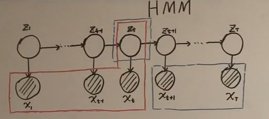

[toc]
# HMM 背景
## HMM 在概率图模型中的地位
- [概率图模型](./概率图模型.md) + 时间 = Dynamic model
  - HMM
  - Kalman Filter
  - Paticle Filter
  - 特点： **样本 $x_i$ 之间 不再独立**；如下图所示：虚线框表示 系统状态(system state), 阴影部分表示观测变量；横向来看，动态模型引入了时间维度；纵向来看，单个时间点，有表现为混合模型;
  
  - 从系统状态来看,动态模型又可以做如下分类
    - 系统状态为离散
      - **HMM**j
    - 系统状态为连续，
      - 线性 Kalman Filter
      - 非线性 Particle Filter
## HMM 模型参数介绍
- HMM 有三类参数: $\lambda = (\pi, A, B)$
$$
\begin{aligned}
&假设\text{HMM} 的观测变量和隐变量的状态可以如下表示 \\
&\bold{观测变量 o}:\left\{o_1, o_2, \cdots, o_t, \cdots \right\}, 对于某个 o_i \in \left\{v_1, v_2, \cdots, v_M \right\}, M 为观测变量可能的取值个数\\
&\bold{状态变量 i}:\left\{i_1, i_2, \cdots, i_t, \cdots \right\}, 对于某个 i_i \in \left\{q_1, q_2, \cdots, q_N \right\}, N 为状态变量的可能取值的个数\\
\end{aligned}
$$
- HMM 参数介绍
$$
\begin{aligned}
&\boldsymbol{\pi} 为初始状态分布，即 t=0时，隐状态的分布\\
&A 为状态转移矩阵，描述了 t-1 到时刻 t 隐状态分布的转移\\
&B 描述了隐状态概率分布到与观测状态的概率分布的关系 \\
&A = [a_{ij}], a_{ij} = p(i_{t+1} = q_j|i_t = q_i)\\
&B = [b_{j}(k)], b_{j}(k) = p(o_t=v_k|i_t=q_j)
\end{aligned}
$$
## HMM 两个假设
- $\bold{齐次 Markov 假设}$ : 当前隐状态仅和前一时刻状态有关
$$
p(i_{t+1}|i_{t}, i_{t - 1}, \cdots, i_{1}, o_{t}, o_{t-1},o_{t-2},\cdots, o_{1}) = p(i_{t+1}|i_{t})
$$
- $\bold{观测独立假设}$ : 当前观测变量仅和当前时刻隐变量有关
$$
p(o_{t}|i_{t}, i_{t - 1}, \cdots, i_{1}, o_{t-1},o_{t-2},\cdots, o_{1}) = p(o_{t}|i_{t})
$$
## HMM 三个问题
  - Evaluation:
    - $p(O|\lambda)$ 基于模型参数求解观测变量的分布
  - Learning:
    - 如何求解模型参数 $\lambda$， $\lambda = \arg \max p(o|\lambda)$: EM算法， Baum Welch算法
  - Decoding:
    - $I = \arg \max_{I}p(I|O)$, 基于观测变量获取隐变量的分布
    - 预测: $p(i_{t+1}|o_1, o_2, \cdots, o_t)$
    - 滤波: $p(i_t|o_1, o_2, \cdots, o_t)$
# Evaluation问题
## 问题定义
$$
给定 \lambda , 求 p(O|\lambda)
$$
## 原始算法
$$
\begin{aligned}
& p(O|\lambda) = \sum_{I} p(I, O | \lambda) = \sum_{I} p(O|I, \lambda) p(I|\lambda)\\
& 对于 \boldsymbol{p(I|\lambda)} \\
&\begin{aligned} p(I|\lambda) &= p(i_1, i_2, \cdots, i_T | \lambda) \\
& = p(i_T|i_1, i_2, \cdots, i_{T - 1}, \lambda) \cdot p(i_1, i_2, \cdots, i_{T - 1}| \lambda)\\
& 由齐次马尔科夫假设\\
&  = p(i_T|i_{T - 1}, \lambda) \cdot p(i_1, i_2, \cdots, i_{T - 1}| \lambda)\\
&=a_{i_{T - 1}, i_T}\cdot p(i_1, i_2, \cdots, i_{T - 1}| \lambda)\\
& = \prod_{t=2}^T a_{i_{t - 1}, i_t}\cdot p(i_1 | \lambda)\\
& = \prod_{t=2}^T a_{i_{t - 1}, i_t}\cdot \pi(a_{i1})\\
\end{aligned}\\
& 对于\boldsymbol{p(O|I, \lambda)}\\
& \begin{aligned} p(O|I, \lambda) &= p(o_1, \cdots, o_T|i_1, \cdots, i_T,\lambda)\\
& = p(o_T|o_1, o_2, \cdots, o_{T-1}, i_1, i_2,  \cdots, i_T,\lambda) \cdot p(o_1, o_2, \cdots, o_{T-1}| i_1, i_2,  \cdots, i_T,\lambda)\\
& 由观测独立性假设\\
& = p(o_T| i_T, \lambda) \cdot p(o_1, o_2, \cdots, o_{T-1}| i_1, i_2,  \cdots, i_T, \lambda)\\
& = \prod_{t=2}^T p(o_t| i_t, \lambda) \cdot p(o_1| i_1, i_2,  \cdots, i_T, \lambda)\\
& = \prod_{t=1}^T p(o_t| i_t, \lambda)\\
& = \prod_{t=1}^T b_{i_t}(o_t)\\
\end{aligned}\\
& 综上\\
& p(O|\lambda) = \sum_{I} \prod_{t=2}^T a_{i_{t - 1}, i_t} \cdot \pi(a_{i1}) \prod_{t=1}^T b_{i_t} (o_t)\\
& 也即是\\
& p(O|\lambda) = \underbrace{\sum_{i_1}\sum_{i_2} \cdots \sum_{i_T} }_{O(N^T)}\prod_{t=2}^T a_{i_{t - 1}, i_t}\cdot \pi(a_{i1}) \prod_{t=1}^T b_{i_t o_t}\\
& 观察可知，时间复杂度关于时间T,状态空间的大小成指数级别。\\
&下面介绍梯度前向算法用于降低时间复杂度。
\end{aligned}
$$
## 前向算法

$$
\begin{aligned}
& 记:\\
& \alpha_t(j) = p(o_1,o_2, \cdots, o_t, i_t=q_j|\lambda) \\
& \alpha_T(j) = p(o_1,o_2, \cdots, o_T, i_T=q_j|\lambda) = p(O, i_T = q_j|\lambda)\\
& p(O|\lambda) = \sum_{j=1}^{N} p(O, i_t = q_j|\lambda) = \sum_{j=1}^{N} \alpha_{T}(j)\\
& 对于 \alpha_t(j)\\
& \begin{aligned}
\alpha_{t+1}(j) &= p(o_1, o_2, \cdots, o_t, o_{t+1}, i_{t+1}=q_j|\lambda)\\
& 引入 i_t\\
&= \sum_{k=1}^{N} p(o_1, o_2, \cdots, o_t, o_{t+1}, i_{t}=q_k, i_{t+1}=q_j|\lambda)\\
&= \sum_{k=1}^{N} p( o_{t+1}|o_1, o_2, \cdots, o_t, i_{t}=q_k, i_{t+1}=q_j) p(o_1, o_2, \cdots, o_t, i_{t}=q_k, i_{t+1}=q_j|\lambda)\\
& 由观测独立性假设\\
&= \sum_{k=1}^{N} p( o_{t+1}| i_{t+1}=q_j) p(o_1, o_2, \cdots, o_t, i_{t}=q_k, i_{t+1}=q_j|\lambda)\\
&= \sum_{k=1}^{N} p( o_{t+1}| i_{t+1}=q_j) p(i_{t+1}=q_j |o_1, o_2, \cdots, o_t, i_{t}=q_k, \lambda) p(o_1, o_2, \cdots, o_t, i_{t}=q_k|\lambda)\\
& 由齐次马尔科夫性\\
&= \sum_{k=1}^{N} p( o_{t+1}| i_{t+1}=q_j) p(i_{t+1}=q_j | i_{t}=q_k, \lambda) p(o_1, o_2, \cdots, o_t, i_{t}=q_k|\lambda)\\
& 由 \alpha 定义\\
&= \sum_{k=1}^{N} p( o_{t+1}| i_{t+1}=q_j) p(i_{t+1}=q_j | i_{t}=q_k, \lambda) \alpha_{t}(k)\\
&= \sum_{k=1}^{N} b_{j}(o_{t+1}) a_{k j}\alpha_{t}(k)\\
\end{aligned}\\
&获取到 \alpha_{t+1} 与 \alpha_{t} 关系以后;\\
& \alpha_1(i) = p(o_1, i_1 = q_i |\lambda) = p(o_1| i_1 = q_i,\lambda) p(i_1 = q_i,\lambda) = b_{i}(o_1) \cdot \pi(i)\\
& 由此可以递归获取 \alpha_1(i) \cdots \alpha_T(i); 
\end{aligned}
$$
### 前向算法流程
- 计算时刻 $1$ 隐状态概率分布
$\alpha_{1}(k) = \pi(k)b_k(o_1), k=1, 2, ..., N$
- 递推各个时刻的 $\alpha$
$$
\alpha_{t+1}(j)= \sum_{k=1}^{N} b_{j}(o_{t+1}) a_{k j}\alpha_{t}(k)
$$
- 计算最终结果
$$
p(O|\lambda) = \sum^N_{j=1}\alpha_{T}(j)
$$
## 后向算法

$$
\begin{aligned}
& 记 \beta_t(i) = p(o_{t+1}, \cdots, o_T|i_t=q_i, \lambda)\\
& 对于 p(O|\lambda)\\
& \begin{aligned} p(O|\lambda) &= p(o_1, \cdots, o_T|\lambda)\\
&= \sum_{k=1}^{N} p(o_1, \cdots, o_T, i_1 =q_k|\lambda)\\
&= \sum_{k=1}^{N} p(o_1, \cdots, o_T, i_1 =q_k|\lambda)\\
&= \sum_{k=1}^{N} p(o_1|o_2 \cdots, o_T, i_1 =q_k,\lambda) p(o_2, \cdots, o_T, i_1 =q_k|\lambda)\\
&= \sum_{k=1}^{N} p(o_1|o_2 \cdots, o_T, i_1 =q_k,\lambda) p(o_2, \cdots, o_T, i_1 =q_k|\lambda)\\
&= \sum_{k=1}^{N} p(o_1| i_1 =q_k,\lambda) p(o_2, \cdots, o_T, i_1 =q_k|\lambda)\\
&= \sum_{k=1}^{N} b_{k}(o_1) p(o_2, \cdots, o_T, i_1 =q_k|\lambda)\\
&= \sum_{k=1}^{N} b_{k}(o_1) p(o_2, \cdots, o_T| i_1 =q_k, \lambda) p(i_1 = q_k|\lambda)\\
&= \sum_{k=1}^{N} b_{k}(o_1) p(o_2, \cdots, o_T| i_1 =q_k, \lambda) \pi(k)\\
& 由 \beta 定义\\
&= \sum_{k=1}^{N} b_{k}(o_1) \beta_1(k)\pi(k)\\
\end{aligned}\\
& 下面推导 \beta_{t} 与 \beta_{t+1} 之间的关系\\
& \begin{aligned}
\beta_t(i) &= p(o_{t+1}, \cdots, o_T|i_t=q_i, \lambda)\\
&= \sum_{k=1}^{N} p(o_{t+1}, \cdots, o_T, i_{t+1} = q_k |i_t=q_i, \lambda)\\
&= \sum_{k=1}^{N} p(o_{t+1}, \cdots, o_T, i_{t+1} = q_k |i_t=q_i, \lambda)\\
&= \sum_{k=1}^{N} p(o_{t+1}|o_{t+2} \cdots, o_T, i_{t+1} = q_k ,i_t=q_i, \lambda) p(o_{t+2} \cdots, o_T, i_{t+1} = q_k |i_t=q_i, \lambda)\\
& 由观察独立性\\
&= \sum_{k=1}^{N} p(o_{t+1}|i_{t+1} = q_k , \lambda) p(o_{t+2} \cdots, o_T, i_{t+1} = q_k |i_t=q_i, \lambda)\\
&= \sum_{k=1}^{N} p(o_{t+1}|i_{t+1} = q_k , \lambda) p(o_{t+2}, \cdots, o_T | i_{t+1} = q_k, i_t=q_i, \lambda) p(i_{t+1} = q_k |i_t=q_i, \lambda)\\
& 由概率图性质 \\
&= \sum_{k=1}^{N} p(o_{t+1}|i_{t+1} = q_k , \lambda) p(o_{t+2}, \cdots, o_T | i_{t+1} = q_k, \lambda) p(i_{t+1} = q_k |i_t=q_i, \lambda)\\
&= \sum_{k=1}^{N} b_{k}(o_{t+1}) \beta_{t+1}(k) a_{ik}\\
\end{aligned}\\
& 由此，得到 \beta_{t+1} 到 \beta_{t} 的递推式
\end{aligned}
$$
### 后向算法流程
- 初始化时刻$T$的各个隐藏状态后向概率
$$
\beta_{T}(i) = 1, i=1, 2, ..., N
$$
- 递推各个时刻的$\beta_t$
$$
\beta_{t} = \sum_{k=1}^{N} b_{k}(o_{t+1}) \beta_{t+1}(k) a_{ik}
$$
- 计算最终结果
$$
p(O|\lambda) = \sum_{k=1}^{N} b_{k}(o_1) \beta_1(k)\pi(k)
$$
## 三种求解算法总结
- 原始方法:
$$
p(O|\lambda) = \underbrace{\sum_{i_1}\sum_{i_2} \cdots \sum_{i_T} }_{O(N^T)}\prod_{t=2}^T a_{i_{t - 1}, i_t}\cdot \pi(a_{i1}) \prod_{t=1}^T b_{i_t o_t}
$$
时间复杂度: $O(N^T)$
- 前向算法
$$
p(O|\lambda) = \sum_{j=1}^{N} p(O, i_t = q_j|\lambda) = \sum_{j=1}^{N} \alpha_{T}(j)
$$
时间复杂度: $O(T \cdot N^2)$
- 后向算法
$$
p(O|\lambda) = \sum_{k=1}^{N} b_{k}(o_1) \beta_1(k)\pi(k)
$$
时间复杂度: $O(T \cdot N^2)$
# Learning 问题-EM算法 特例: Baum Welch
首先引入EM算法的优化公式
$$
\theta^{(t+1)} = \arg \max_{\theta} \int_z \log p(x, z|\theta) \cdot p(z|x, \theta^{(t)})dz
$$
对应的HMM中的$x, z, \theta$ 分别为 $O, I, \lambda$
$$
\begin{aligned}
&\lambda^{(t+1)} = \arg \max_{\lambda} \sum_{I} log p(O, I|\lambda) p(O, I|\lambda^{(t)}) \\
&其中 \lambda^{t} = [\pi^{t}, A^{t}, B^{t}]\\
& 由 p(O|\lambda) = \sum_{I} \prod_{t=2}^T a_{i_t i_{t - 1}}\cdot \pi(i_1) \prod_{t=1}^T b_{i_t o_t}\\
& \lambda^{(t+1)} = \arg \max_{\lambda} \sum_{I} log p(O, I|\lambda) p(O, I|\lambda^{(t)})\\
& \Rightarrow \lambda^{(t+1)} = \arg \max_{\lambda} \sum_{I} \left[\log \left(\prod_{t=2}^T a_{i_t i_{t - 1}}\cdot \pi(i_1) \prod_{t=1}^T b_{i_t o_t}\right)  p(O, I|\lambda^{(t)})\right]\\
& \Rightarrow \lambda^{(t+1)} = \arg \max_{\lambda} \sum_{I} \left[\left( \sum_{t=2}^T \log a_{i_t i_{t - 1}} + \log \pi(i_1) +  \sum_{t=1}^T \log b_{i_t o_t}  \right) p(O, I|\lambda^{(t)})\right]\\
& 对 \pi 进行求解\\
& 对应的优化问题为\\
& \lambda^{(t+1)} = \arg \max_{\lambda} \sum_{I} \left[\left( \sum_{t=2}^T \log a_{i_t i_{t - 1}} + \log \pi(i_1) +  \sum_{t=1}^T \log b_{i_t o_t}  \right) p(O, I|\lambda^{(t)})\right]\\
& 对应的约束为 \sum_{k=1}^{|I|} \pi(i_1) = 1\\ 
& 对应的拉格朗日问题为\\
& \lambda^{(t+1)} = \sum_{I} \left[\left( \sum_{t=2}^T \log a_{i_t i_{t - 1}} + \log \pi(i_1) +  \sum_{t=1}^T \log b_{i_t o_t}  \right) p(O, I|\lambda^{(t)})\right] + \eta (1 - \sum_{k=1}^{|I|} \pi(i_1))\\
& 对 \pi 求导 得;\\
&\frac{\partial }{\partial \pi} \sum_{I} \left[\left( \sum_{t=2}^T \log a_{i_t i_{t - 1}} + \log \pi(i_1) +  \sum_{t=1}^T \log b_{i_t o_t}  \right) p(O, I|\lambda^{(t)})\right] + \eta (1 - \sum_{k=1}^{|I|} \pi(i_1))  = 0\\
& \Leftrightarrow \frac{\partial }{\partial \pi} \sum_{I} \left[\log \pi(i_1) p(O, I|\lambda^{(t)})\right] + \eta (1 - \sum_{k=1}^{|I|} \pi(i_1))= 0\\
& \Leftrightarrow \frac{\partial }{\partial \pi} \sum_{i_1}\sum_{i_2} \cdots \sum_{i_T} \left[\log \pi(i_1) p(O, I|\lambda^{(t)})\right] + \eta (1 - \sum_{k=1}^{|I|} \pi(i_1)) = 0\\
& \Leftrightarrow \frac{\partial }{\partial \pi} \sum_{i_1}\sum_{i_2} \cdots \sum_{i_T} \left[\log \pi(i_1) p(O, I|\lambda^{(t)})\right] + \eta (1 - \sum_{k=1}^{|I|} \pi(i_1)) = 0\\
& \Leftrightarrow \frac{\partial }{\partial \pi} \sum_{i_1}\sum_{i_2} \cdots \sum_{i_T} \left[\log \pi(i_1) p(O, I|\lambda^{(t)})\right] + \eta (1 - \sum_{k=1}^{|I|} \pi(i_1)) = 0\\
& \Leftrightarrow \frac{\partial }{\partial \pi} \sum_{i_1} \left[\log \pi(i_1) \sum_{i_2} \cdots \sum_{i_T} p(O, I|\lambda^{(t)})\right] + \eta (1 - \sum_{k=1}^{|I|} \pi(i_1)) = 0\\
& \Leftrightarrow \frac{\partial }{\partial \pi} \sum_{i_1} \left[\log \pi(i_1)  p(O, i_1|\lambda^{(t)})\right] + \eta (1 - \sum_{k=1}^{|I|} \pi(i_1)) = 0\\
& \Rightarrow \frac{\partial }{\partial \pi} \sum_{i_1}\left[\log \pi(i_1)  p(O, i_1|\lambda^{(t)})\right] + \eta (1 - \sum_{k=1}^{|I|} \pi(i_1))= 0\\
& \Rightarrow \frac{\partial }{\partial \pi} \sum_{k=1}^{|I|}\left[\log \pi_k  p(O, i_1|\lambda^{(t)})\right] + \eta (1 - \sum_{k=1}^{|I|} \pi_{k})= 0\\
& \Rightarrow \frac{\partial }{\partial \pi_k} \sum_{k=1}^{|I|}\left[\log \pi_k  p(O, i_1|\lambda^{(t)})\right] + \eta (1 - \sum_{k=1}^{|I|} \pi_{k})= 0\\
& \Rightarrow  \frac{1}{\pi_k}  p(O, i_1|\lambda^{(t)}) - \eta = 0\\
& \Rightarrow  p(O, i_1|\lambda^{(t)}) - \eta \pi_k= 0\\
& \Rightarrow \pi_k = \frac{1 }{\eta} p(O, i_1|\lambda^{(t)})\\
& 由 \sum_{k=1}^{|I|} \pi_k = 1 得\\
& \sum_{i=1}^{|I|} p(O, i_1|\lambda^{(t)}) - \eta \pi_k \Rightarrow p(O |\lambda^{(t)}) - \eta = 0 \\
& \Rightarrow \eta = p(O |\lambda^{(t)}) \\
& \Rightarrow \pi_k = \frac{1 }{\eta} p(O, i_1|\lambda^{(t)}) = \frac{p(O, i_1|\lambda^{(t)})}{p(O |\lambda^{(t)})} \\
& 即 \pi_{k}^{t+1} = \frac{p(O, i_1|\lambda^{(t)})}{p(O |\lambda^{(t)})}， 其中 \pi_{k}^{t} 由 \lambda^{t} 给出\\
& 由此，获取了EM算法中，t次迭代和t+1次迭代 中 \pi^{t+1} 和 \pi^{t} 之间的关系。
\end{aligned}
$$
# Decoding 问题 维特比算法(Viterbi)

这里主要用到了动态规划的思想；
定义如下变量:
$$
\begin{aligned}
\delta_t(i) &= \max_{i_1, i_2, \cdots, i_{t-1}} p(o_1, o_2, \cdots, o_{t}, i_1, i_2, \cdots, i_{t-1}, i_t=q_i)\\
\delta_{t+1}(j) &= \max_{i_1, i_2, \cdots, i_{t}} p(o_1, o_2, \cdots, o_{t},  o_{t+1}, i_1, i_2, \cdots, i_{t}, i_{t+1}=q_i)\\
& 由转移矩阵，发射矩阵， \delta_t(i) 的定义，结合上图\\
&= \max_{1 \leq i \leq N} \delta_{t}(i)a_{ij}b_{j}(o_{t+1})\\
& 通过以上递推式，可以得到 \delta_{T}(j) 的估计\\
& 同时，我们需要记录 \delta_{t+1}(j) 取得最大值是对应的i的值， 用于记录路径，以便在求出 所有解以后，恢复出最优路径。
\end{aligned}
$$
# Dynamic model 总结

动态模型对应的问题可以分为两类:
- Learning 对模型的参数进行学习, 主要使用 前面提到的**EM算法(Baum Welch)**
- Inference 推断问题（假设 $x$ 为观测变量，$z$ 为隐变量）
  - decoding: $p(z_1, z_2, \cdots, z_t| x_1, x_2, \cdots, x_t)$, 也即是通过观测变量推断隐变量的分布。求解的算法为上节介绍的 **viterbi 算法**
  - prob of evidence: $p(X|\theta) = p(x_1, x_2, \cdots, x_t|\theta)$ 也即是对于观测变量的出现概率的估计。求解算法为上节提到的**Forward algorithm** 和 **Backward algorithm**

  - filtering: $p(z_t| x_1, x_2, \cdots, x_t)$ 即，根据 $1-t$ 时刻的观测变量推测 $t$ 时刻隐状态 $z_t$ 的分布;多用于在线(online)问题随着时间不断估计对应时刻的隐变量。
$$
p(z_t| x_1, x_2, \cdots, x_t) = \frac{p(z_t, x_1, x_2, \cdots, x_t)}{p(x_1, x_2, \cdots, x_t)} \propto p(z_t, x_1, x_2, \cdots, x_t) = \alpha_t
$$
由此，可通过**前向算法**解决该问题。
  - smoothing: $p(z_t| x_1, x_2, \cdots, x_T)$即，在获取所有数据以后，依据所有时刻 $1-T$的观测变量推测t时刻隐状态 $z_t$ 的分布;多用于离线(offline)任务,利用所有观测数据估计某个时刻的隐变量
$$
\begin{aligned}
p(z_t| x_1, x_2, \cdots, x_T) &= \frac{p(z_t, x_1, x_2, \cdots, x_T)} {p(x_1, x_2, \cdots, x_T)} \\
& \propto p(z_t, x_1, x_2, \cdots, x_T) \\
& = p(x_{t+1}, \cdots, x_{T} | x_1, \cdots, x_{t}, z_{t}) p(x_1, \cdots, x_{t}, z_{t}) \\
& 由概率图性质\\
& = p(x_{t+1}, \cdots, x_{T} | z_{t}) p(x_1, \cdots, x_{t}, z_{t}) \\
& 由 \alpha, \beta 定义可知\\
& = \beta_t \alpha_t
\end{aligned}
$$
这里同时用到了**前向和反向**算法，因此求解方法叫做**Forward-Backward algorithm**
  - prediction: 分为两类，依次为对隐变量的预测和对观测变量的预测
    - $p(z_{t+1} | x_1, x_2, \cdots, x_t)$
$$
\begin{aligned}
p(z_{t+1}|x_1, x_2, \cdots, x_t) &= \sum_{z_t} p(z_{t+1}, z_t|x_1, x_2, \cdots, x_t)\\
&= \sum_{z_t} p(z_{t+1} | z_t, x_1, x_2, \cdots, x_t) p(z_t|x_1, x_2, \cdots, x_t)\\
&= \sum_{z_t} \underbrace{p(z_{t+1} | z_t)}_{a_{z_t z_{t+1}}} \underbrace{p(z_t|x_1, x_2, \cdots, x_t)}_{filtering 问题}\\
\end{aligned}
$$
    - $p(x_{t+1} |x_1, x_2, \cdots, x_t)$
$$
\begin{aligned}
 p(x_{t+1} |x_1, x_2, \cdots, x_t) &= \sum_{z_{t+1}} p(x_{t+1}, z_{t+1}|x_1, x_2, \cdots, x_t)\\
 &= \sum_{z_{t+1}} \underbrace{p(x_{t+1}|z_{t+1},x_1, x_2, \cdots, x_t)}_{p(x_{t+1}| z_{t+1})} \underbrace{p(z_{t+1}|x_1, x_2, \cdots, x_t)}_{第一个预测问题}\\
\end{aligned}
$$
综上，**prediction** 问题可以使用 **前向算法** 解决
# BKT 与 HMM 的联系
$$
\begin{aligned}
&状态转移矩阵\\
&\begin{array}{ccc}
&                &\text{from known} & \text{from unknown}\\
& \text{to known} &1 &p(T)\\
& \text{to unknown} &0 &1 - p(T)\\
\end{array}\\
&发射矩阵\\
&\begin{array}{ccc}
&                &\text{from known} & \text{from unknown}\\
& \text{right} &1 - p(S) &p(G)\\
& \text{wrong} &p(S) &1 - p(G)\\
\end{array}\\
& 记\ 状态转移矩阵 A = \left[\begin{array}{cc}
1 &p(T)\\
0 &1 - p(T)\\
\end{array}\right]\\
&发射矩阵 B = \left[\begin{array}{cc}
1 - p(S) &p(G)\\
p(S) &1 - p(G)\\
\end{array}\right]\\
\end{aligned}
$$
对于每道题(知识点) 的掌握情况，先验分布如下($L_0$ 代表 初始时刻的掌握状态)
$$
l_0 = \left[\begin{array}{c}
p(L_0) \\
1 - p(L_0)\\
\end{array}\right]
$$
由 HMM 推导过程如下
记 
$$
l_{t-1} = \left[\begin{array}{c}
p(L_{t-1}) \\
1 - p(L_{t-1})\\
\end{array}\right]
$$
由状态转移矩阵，得
$$
l_{t} = A \cdot l_{t - 1} = \left[\begin{array}{c}
p(L_{t-1}) + (1 - p(L_{t-1})) \cdot p(T)\\
(1 - p(T)) \cdot (1 - p(L_{t-1}))
\end{array}\right] = \left[\begin{array}{c}
p(L_{t}) \\
1 - p(L_{t})\\
\end{array}\right]
$$
下面是主要对下列公式的推导
$$\begin{aligned}
p\left(L_{t} | Q_{t} = right\right) =\frac{p\left(L_{t}\right) \cdot\left(1-p(S)\right)}{p\left(L_{t}\right) \cdot\left(1-p(S)\right)+\left(1-p\left(L_{t}\right)\right) \cdot p(G)} \quad (1)\\
p\left(L_{t} | Q_{t} = wrong\right) =\frac{p\left(L_{t}\right) \cdot p(S)}{p\left(L_{t}\right) \cdot p(S)+\left(1-p\left(L_{t}\right)\right) \cdot\left(1-p(G)\right)}  \quad (2)\\
p\left(L_{t+1}\right) =p\left(L_{t} |Q_{t}\right)+\left(1-p\left(L_{t} | Q_{t}\right)\right) \cdot p(T)  \quad (3)\\
p(Q_{t} = right) =p\left(L_{t}\right)\cdot\left(1-p(S)\right)+\left(1-p\left(L_{t}\right)\right) \cdot p(G)  \quad (4)
\end{aligned}$$
由发射矩阵 得:
$$
\begin{aligned}
\left[\begin{array}{c}
p(Q_{t} = right) \\
p(Q_{t} = wrong)\\
\end{array}\right] 
&= B \cdot \left[\begin{array}{c}
p(L_{t}) \\
1 - p(L_{t})\\
\end{array}\right] \\
&= \left[\begin{array}{c}
(1 - p(S)) \cdot p(L_t) + p(G) \cdot (1 - p(L_t))\\ 
p(S) \cdot p(L_t) + (1 - p(G)) \cdot (1 - p(L_t)) \\
\end{array}\right]\\
\end{aligned}
$$
由第一个分量可知，(4) 得证
分析可知
$$
\begin{aligned}
&p(L_{t} , Q_{t} = right) = (1 - p(S)) \cdot p(L_{t})\\
&\text{所以}\\
&p(l_{t}| Q_{t} = right) = \frac{p(L_{t} , Q_{t} = right)}{p(Q_{t} = right)} = \frac{(1 - p(S)) \cdot p(L_{t})}{(1 - p(S)) \cdot p(L_t) + p(G) \cdot (1 - p(L_t))}\\
&(1) 得证\\
& 同理 (2)\\
& p(l_{t}|Q_{t} = wrong) = \frac{p(S) \cdot p(L_t)}{p(S) \cdot p(L_t) + (1 - p(G)) \cdot (1 - p(L_t))}\\
& 由此 对于时刻 t，若获得观察量Q_{t} = right\\
& l_t = \left[\begin{array}{c}
p(L_t|Q_{t} = right) \\
1 - p(L_t|Q_{t} = right)\\
\end{array}\right] \\
&若获得观察量Q_{t} = wrong\\
& l_t = \left[\begin{array}{c}
p(L_t|Q_{t} = wrong) \\
1 - p(L_t|Q_{t} = wrong)\\
\end{array}\right]\\
& 记 \left[\begin{array}{c}
p(L_t|Q_{t}) \\
1 - p(L_t|Q_{t})\\
\end{array}\right] 为获取到观察量Q_{t} 后的 l_t 分布 \\
& 由概率转移矩阵\\
&\left[\begin{array}{c}
p(L_{t+1}) \\
1 - p(L_{t+1})\\
\end{array}\right] = A \cdot l_{t} = \left[\begin{array}{c}
p(L_{t}|Q_{t}) + (1 - p(L_{t}|Q_{t})) \cdot p(T)\\
(1 - p(T)) \cdot (1 - p(L_{t}|Q_{t}))
\end{array}\right] \\
& 由第一个分量可知，(3) 得证
\end{aligned}
$$

