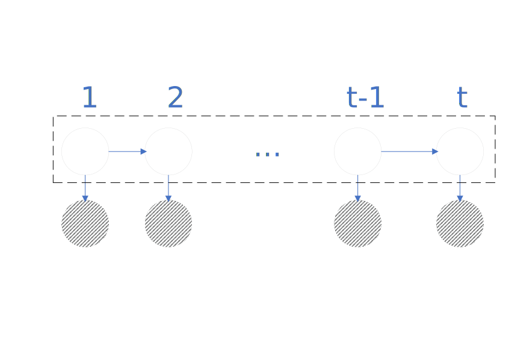

# 背景
- 概率图模型
  - 有向 Bayesian Network
  - 无向 Markov Random Field(Markov Network) 
- 概率图模型 + 时间 = Dynamic model
  - HMM
  - Kalman Filter
  - Paticle Filer
  - 特点： **样本 $x_i$ 之间 不再独立**；如下图所示：虚线框表示 系统状态(system state), 阴影部分表示观测变量；横向来看，动态模型引入了时间维度；纵向来看，单个时间点，有表现为混合模型;
  
  - 从系统状态来看；
    - 系统状态为离散，则为HMM;
    - 系统状态为连续，
      - **线性** Kalman Filter
      - 非线性 Particle Filter
- 对于HMM 说，参数有三个
$$
\begin{aligned}
&\lambda = (\pi, A, B) \\
& 假设 \\
&观测变量 O:\left\{o_1, o_2, \cdots, o_t, \cdots \right\}, 对于某个 o_i \in \left\{v_1, v_2, \cdots, v_{|O|}\right\}\\
&观测变量 i:\left\{i_1, i_2, \cdots, i_t, \cdots \right\}, 对于某个 i_i \in \left\{q_1, q_2, \cdots, q_{|I|}\right\}\\
&\pi 为初始状态分布，即 t=1时，隐状态的分布\\
&A 为状态转移矩阵，表示了时刻t-1 到时刻t 隐状态分布的变化\\
&B 表示隐状态概率分布到与观测状态的概率分布的关系 \\
&A = [a_{ij}], a_{ij} = p(i_{t+1} = q_j|i_{i} = q_i)\\
&B = [b_{jk}], b_{jk} = p(o_t=v_k|i_t=q_j)
\end{aligned}
$$
- HMM的两个假设：
  - 齐次 Markov 假设
$$
p(i_{t+1}|i_{t}, i_{t - 1}, \cdots, i_{1}, o_{t}, o_{t-1},o_{t-2},\cdots, o_{1}) = p(i_{t+1}|i_{t})
$$
  - 观测独立假设
$$
p(o_{t}|i_{t}, i_{t - 1}, \cdots, i_{1}, o_{t-1},o_{t-2},\cdots, o_{1}) = p(o_{t}|i_{t})
$$
- HMM 主要三个问题
  - Evaluation:
    - $p(O|\lambda)$ 基于模型参数求解观测变量的分布
  - Learning:
    - 如何求解模型参数 $\lambda$， $\lambda = \arg \max p(o|\lambda)$: EM算法， Baum Welch算法
  - Decoding:
    - $I = \arg \max_{I}p(I|O)$, 基于观测变量获取隐变量的分布
    - 预测: $p(i_{t+1}|o_1, o_2, \cdots, o_t)$
    - 滤波: $p(i_t|o_1, o_2, \cdots, o_t)$
# Evaluation问题求解
## 原始算法
$$
\begin{aligned}
& 给定 \lambda , 求 p(O|\lambda)\\
& p(o|\lambda) = \sum_{I} p(I, O | \lambda) = \sum_{I} p(O|I, \lambda) p(I|\lambda)\\
& 对于 p(I|\lambda) \\
& p(I|\lambda) = p(i_1, i_2, \cdots, i_T | \lambda) = p(i_T|i_1, i_2, \cdots, i_{T - 1}, \lambda) \cdot p(i_1, i_2, \cdots, i_{T - 1}| \lambda)\\
& 由齐次马尔科夫假设\\
& p(I|\lambda) = p(i_1, i_2, \cdots, i_T | \lambda) = p(i_T|i_{T - 1}, \lambda) \cdot p(i_1, i_2, \cdots, i_{T - 1}| \lambda)\\
& p(I|\lambda) = p(i_1, i_2, \cdots, i_T | \lambda) = a_{i_T i_{T - 1}}\cdot p(i_1, i_2, \cdots, i_{T - 1}| \lambda)\\
& 由此可得\\
& p(I|\lambda) = p(i_1, i_2, \cdots, i_T | \lambda) = \prod_{t=2}^T a_{i_t i_{t - 1}}\cdot p(i_1 | \lambda)\\
& p(I|\lambda) = p(i_1, i_2, \cdots, i_T | \lambda) = \prod_{t=2}^T a_{i_t i_{t - 1}}\cdot \pi(i_1)\\
& 对于 p(O|I, \lambda) \\
& p(O|I, \lambda) = p(o_1, \cdots, o_T|i_1, \cdots, i_T | \lambda)\\
& p(O|I, \lambda) = p(o_T|o_1, o_2, \cdots, o_{T-1}, i_1, i_2,  \cdots, i_T,\lambda) \cdot p(o_1, o_2, \cdots, o_{T-1}| i_1, i_2,  \cdots, i_T|\lambda)\\
& 由观测独立性假设\\
& p(O|I, \lambda) = p(o_T| i_T, \lambda) \cdot p(o_1, o_2, \cdots, o_{T-1}| i_1, i_2,  \cdots, i_T, \lambda)\\
& p(O|I, \lambda) = \prod_{t=2}^T p(o_t| i_t, \lambda) \cdot p(o_1| i_1, i_2,  \cdots, i_T, \lambda)\\
& p(O|I, \lambda) = \prod_{t=1}^T p(o_t| i_t, \lambda)\\
& p(O|I, \lambda) = \prod_{t=1}^T b_{i_t o_t}\\
& 综上\\
& p(o|\lambda) = \sum_{I} \prod_{t=2}^T a_{i_t i_{t - 1}}\cdot \pi(i_1) \prod_{t=1}^T b_{i_t o_t}\\
& 也即是\\
& p(o|\lambda) = \underbrace{\sum_{i_1}\sum_{i_2} \cdots \sum_{i_T} }_{O(|I|^T)}\prod_{t=2}^T a_{i_t i_{t - 1}}\cdot \pi(i_1) \prod_{t=1}^T b_{i_t o_t}\\
& 观察可知，时间复杂度关于时间T,状态空间的大小成指数级别。\\
&下面介绍梯度前向算法用于降低时间复杂度。
\end{aligned}
$$
## 前向算法
$$
\begin{aligned}
& 记:\\
& \alpha_t(i) = p(o_1,o_2, \cdots, o_t, i_t=q_i|\lambda) \\
& \alpha_T(i) = p(o_1,o_2, \cdots, o_T, i_T=q_i|\lambda) = p(O, i_t = q_i|\lambda)\\
& p(O|\lambda) = \sum_{i=1}^{|I|} p(O, i_t = q_i|\lambda) = \sum_{i=1}^{|I|} \alpha_{T}(i)\\
& 对于 \alpha_t(i)\\
& \begin{aligned}
\alpha_{t+1}(j) &= p(o_1, o_2, \cdots, o_t, o_{t+1}, i_{t+1}=q_j|\lambda)\\
&= \sum_{k=1}^{|I|} p(o_1, o_2, \cdots, o_t, o_{t+1}, i_{t}=q_k, i_{t+1}=q_j|\lambda)\\
&= \sum_{k=1}^{|I|} p( o_{t+1}|o_1, o_2, \cdots, o_t, i_{t}=q_k, i_{t+1}=q_j) p(o_1, o_2, \cdots, o_t, i_{t}=q_k, i_{t+1}=q_j|\lambda)\\
& 由观测独立性假设\\
&= \sum_{k=1}^{|I|} p( o_{t+1}| i_{t+1}=q_j) p(o_1, o_2, \cdots, o_t, i_{t}=q_k, i_{t+1}=q_j|\lambda)\\
&= \sum_{k=1}^{|I|} p( o_{t+1}| i_{t+1}=q_j) p(i_{t+1}=q_j |o_1, o_2, \cdots, o_t, i_{t}=q_k, \lambda) p(o_1, o_2, \cdots, o_t, i_{t}=q_k|\lambda)\\
& 由齐次马尔科夫性\\
&= \sum_{k=1}^{|I|} p( o_{t+1}| i_{t+1}=q_j) p(i_{t+1}=q_j | i_{t}=q_k, \lambda) p(o_1, o_2, \cdots, o_t, i_{t}=q_k|\lambda)\\
& 由 \alpha 定义\\
&= \sum_{k=1}^{|I|} p( o_{t+1}| i_{t+1}=q_j) p(i_{t+1}=q_j | i_{t}=q_k, \lambda) \alpha_{t}(k)\\
&= \sum_{k=1}^{|I|} b_{j o_{t+1}} b_{k j}\alpha_{t}(k)\\
\end{aligned}\\
&获取到 \alpha_{t+1} 与 \alpha_{t} 关系以后;\\
& \alpha_1(i) = p(o_1, i_1 = q_i |\lambda) = p(o_1| i_1 = q_i,\lambda) p(i_1 = q_i,\lambda) = b_{i o_1} \pi(i)\\
& 由此可以递归获取 \alpha_1(i) \cdots \alpha_T(i); 
\end{aligned}
$$
## 后向算法
$$
\begin{aligned}
& 记 \beta_t(i) = p(o_{t+1}, \cdots, o_T|i_t=q_i, \lambda)\\
& \beta_{T-1}(i) = p( o_T|i_{T-1}=q_i, \lambda)\\ 
& \beta_{1}(i) = p(o_2, \cdots, o_T|i_1=q_i, \lambda)\\
& 对于 p(O|\lambda)\\
& \begin{aligned} p(O|\lambda) &= p(o_1, \cdots, o_T|\lambda)\\
&= \sum_{k=1}^{|I|} p(o_1, \cdots, o_T, i_1 =q_k|\lambda)\\
&= \sum_{k=1}^{|I|} p(o_1, \cdots, o_T, i_1 =q_k|\lambda)\\
&= \sum_{k=1}^{|I|} p(o_1|o_2 \cdots, o_T, i_1 =q_k,\lambda) p(o_2, \cdots, o_T, i_1 =q_k|\lambda)\\
&= \sum_{k=1}^{|I|} p(o_1|o_2 \cdots, o_T, i_1 =q_k,\lambda) p(o_2, \cdots, o_T, i_1 =q_k|\lambda)\\
&= \sum_{k=1}^{|I|} p(o_1| i_1 =q_k,\lambda) p(o_2, \cdots, o_T, i_1 =q_k|\lambda)\\
&= \sum_{k=1}^{|I|} b_{k o_1} p(o_2, \cdots, o_T, i_1 =q_k|\lambda)\\
&= \sum_{k=1}^{|I|} b_{k o_1} p(o_2, \cdots, o_T| i_1 =q_k, \lambda) p(i_1 = q_k|\lambda)\\
&= \sum_{k=1}^{|I|} b_{k o_1} p(o_2, \cdots, o_T| i_1 =q_k, \lambda) \pi(k)\\
& 由 \beta 定义\\
&= \sum_{k=1}^{|I|} b_{k o_1} \beta_1(k)\pi(k)\\
\end{aligned}\\
& 下面推导 \beta_{t} 与 \beta_{t+1} 之间的关系\\
& \begin{aligned}
\beta_t(i) &= p(o_{t+1}, \cdots, o_T|i_t=q_i, \lambda)\\
&= \sum_{k=1}^{|I|} p(o_{t+1}, \cdots, o_T, i_{t+1} = q_k |i_t=q_i, \lambda)\\
&= \sum_{k=1}^{|I|} p(o_{t+1}, \cdots, o_T, i_{t+1} = q_k |i_t=q_i, \lambda)\\
&= \sum_{k=1}^{|I|} p(o_{t+1}|o_{t+2} \cdots, o_T, i_{t+1} = q_k ,i_t=q_i, \lambda) p(o_{t+2} \cdots, o_T, i_{t+1} = q_k |i_t=q_i, \lambda)\\
& 由观察独立性\\
&= \sum_{k=1}^{|I|} p(o_{t+1}|i_{t+1} = q_k , \lambda) p(o_{t+2} \cdots, o_T, i_{t+1} = q_k |i_t=q_i, \lambda)\\
&= \sum_{k=1}^{|I|} p(o_{t+1}|i_{t+1} = q_k , \lambda) p(o_{t+2}, \cdots, o_T | i_{t+1} = q_k, i_t=q_i, \lambda) p(i_{t+1} = q_k |i_t=q_i, \lambda)\\
& 由概率图性质 \\
&= \sum_{k=1}^{|I|} p(o_{t+1}|i_{t+1} = q_k , \lambda) p(o_{t+2}, \cdots, o_T | i_{t+1} = q_k, \lambda) p(i_{t+1} = q_k |i_t=q_i, \lambda)\\
&= \sum_{k=1}^{|I|} b_{k o_{t+1}} \beta_{t+1}(k) a_{ik}\\
\end{aligned}\\
& 由此，得到 \beta_{t+1} 到 \beta_{t} 的递推式
\end{aligned}
$$
## 三种求解算法总结
- 原始方法:
$$
p(o|\lambda) = \underbrace{\sum_{i_1}\sum_{i_2} \cdots \sum_{i_T} }_{O(|I|^T)}\prod_{t=2}^T a_{i_t i_{t - 1}}\cdot \pi(i_1) \prod_{t=1}^T b_{i_t o_t}
$$
时间复杂度: $O(|I|^T)$
- 前向算法
$$
p(O|\lambda) = \sum_{i=1}^{|I|} p(O, i_t = q_i|\lambda) = \sum_{i=1}^{|I|} \alpha_{T}(i)
$$
时间复杂度: $O(T \cdot |I|^2)$
# EM算法 特例 ： Baum Welch
首先引入EM算法的优化公式
$$
\theta^{(t+1)} = \arg \max_{\theta} \int_z \log p(x, z|\theta) \cdot p(z|x, \theta^{(t)})dz
$$
对应的HMM中的$x, z, \theta$ 分别为 $O, I, \lambda$
$$
\begin{aligned}
&\lambda^{(t+1)} = \arg \max_{\lambda} \sum_{I} log p(O, I|\lambda) p(O, I|\lambda^{(t)}) \\
&其中 \lambda^{t} = [\pi^{t}, A^{t}, B^{t}]\\
& 由 p(O|\lambda) = \sum_{I} \prod_{t=2}^T a_{i_t i_{t - 1}}\cdot \pi(i_1) \prod_{t=1}^T b_{i_t o_t}\\
& \lambda^{(t+1)} = \arg \max_{\lambda} \sum_{I} log p(O, I|\lambda) p(O, I|\lambda^{(t)})\\
& \Rightarrow \lambda^{(t+1)} = \arg \max_{\lambda} \sum_{I} \left[\log \left(\prod_{t=2}^T a_{i_t i_{t - 1}}\cdot \pi(i_1) \prod_{t=1}^T b_{i_t o_t}\right)  p(O, I|\lambda^{(t)})\right]\\
& \Rightarrow \lambda^{(t+1)} = \arg \max_{\lambda} \sum_{I} \left[\left( \sum_{t=2}^T \log a_{i_t i_{t - 1}} + \log \pi(i_1) +  \sum_{t=1}^T \log b_{i_t o_t}  \right) p(O, I|\lambda^{(t)})\right]\\
& 对 \pi 进行求解\\
& 对应的优化问题为\\
& \lambda^{(t+1)} = \arg \max_{\lambda} \sum_{I} \left[\left( \sum_{t=2}^T \log a_{i_t i_{t - 1}} + \log \pi(i_1) +  \sum_{t=1}^T \log b_{i_t o_t}  \right) p(O, I|\lambda^{(t)})\right]\\
& 对应的约束为 \sum_{k=1}^{|I|} \pi(i_1) = 1\\ 
& 对应的拉格朗日问题为\\
& \lambda^{(t+1)} = \sum_{I} \left[\left( \sum_{t=2}^T \log a_{i_t i_{t - 1}} + \log \pi(i_1) +  \sum_{t=1}^T \log b_{i_t o_t}  \right) p(O, I|\lambda^{(t)})\right] + \eta (1 - \sum_{k=1}^{|I|} \pi(i_1))\\
& 对 \pi 求导 得;\\
&\frac{\partial }{\partial \pi} \sum_{I} \left[\left( \sum_{t=2}^T \log a_{i_t i_{t - 1}} + \log \pi(i_1) +  \sum_{t=1}^T \log b_{i_t o_t}  \right) p(O, I|\lambda^{(t)})\right] + \eta (1 - \sum_{k=1}^{|I|} \pi(i_1))  = 0\\
& \Leftrightarrow \frac{\partial }{\partial \pi} \sum_{I} \left[\log \pi(i_1) p(O, I|\lambda^{(t)})\right] + \eta (1 - \sum_{k=1}^{|I|} \pi(i_1))= 0\\
& \Leftrightarrow \frac{\partial }{\partial \pi} \sum_{i_1}\sum_{i_2} \cdots \sum_{i_T} \left[\log \pi(i_1) p(O, I|\lambda^{(t)})\right] + \eta (1 - \sum_{k=1}^{|I|} \pi(i_1)) = 0\\
& \Leftrightarrow \frac{\partial }{\partial \pi} \sum_{i_1}\sum_{i_2} \cdots \sum_{i_T} \left[\log \pi(i_1) p(O, I|\lambda^{(t)})\right] + \eta (1 - \sum_{k=1}^{|I|} \pi(i_1)) = 0\\
& \Leftrightarrow \frac{\partial }{\partial \pi} \sum_{i_1}\sum_{i_2} \cdots \sum_{i_T} \left[\log \pi(i_1) p(O, I|\lambda^{(t)})\right] + \eta (1 - \sum_{k=1}^{|I|} \pi(i_1)) = 0\\
& \Leftrightarrow \frac{\partial }{\partial \pi} \sum_{i_1} \left[\log \pi(i_1) \sum_{i_2} \cdots \sum_{i_T} p(O, I|\lambda^{(t)})\right] + \eta (1 - \sum_{k=1}^{|I|} \pi(i_1)) = 0\\
& \Leftrightarrow \frac{\partial }{\partial \pi} \sum_{i_1} \left[\log \pi(i_1)  p(O, i_1|\lambda^{(t)})\right] + \eta (1 - \sum_{k=1}^{|I|} \pi(i_1)) = 0\\
& \Rightarrow \frac{\partial }{\partial \pi} \sum_{i_1}\left[\log \pi(i_1)  p(O, i_1|\lambda^{(t)})\right] + \eta (1 - \sum_{k=1}^{|I|} \pi(i_1))= 0\\
& \Rightarrow \frac{\partial }{\partial \pi} \sum_{k=1}^{|I|}\left[\log \pi_k  p(O, i_1|\lambda^{(t)})\right] + \eta (1 - \sum_{k=1}^{|I|} \pi_{k})= 0\\
& \Rightarrow \frac{\partial }{\partial \pi_k} \sum_{k=1}^{|I|}\left[\log \pi_k  p(O, i_1|\lambda^{(t)})\right] + \eta (1 - \sum_{k=1}^{|I|} \pi_{k})= 0\\
& \Rightarrow  \frac{1}{\pi_k}  p(O, i_1|\lambda^{(t)}) - \eta = 0\\
& \Rightarrow  p(O, i_1|\lambda^{(t)}) - \eta \pi_k= 0\\
& \Rightarrow \pi_k = \frac{1 }{\eta} p(O, i_1|\lambda^{(t)})\\
& 由 \sum_{k=1}^{|I|} \pi_k = 1 得\\
& \sum_{i=1}^{|I|} p(O, i_1|\lambda^{(t)}) - \eta \pi_k \Rightarrow p(O |\lambda^{(t)}) - \eta = 0 \\
& \Rightarrow \eta = p(O |\lambda^{(t)}) \\
& \Rightarrow \pi_k = \frac{1 }{\eta} p(O, i_1|\lambda^{(t)}) = \frac{p(O, i_1|\lambda^{(t)})}{p(O |\lambda^{(t)})} \\
& 即 \pi_{k}^{t+1} = \frac{p(O, i_1|\lambda^{(t)})}{p(O |\lambda^{(t)})}， 其中 \pi_{k}^{t} 由 \lambda^{t} 给出\\
& 由此，获取了EM算法中，t次迭代和t+1次迭代 中 \pi^{t+1} 和 \pi^{t} 之间的关系。
\end{aligned}
$$