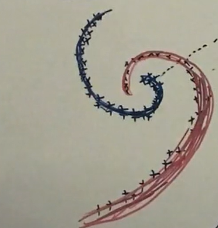

# 聚类算法两种思想
- Compactness， 主要代表模型有 K-means, GMM等。 主要处理的是每个类别的分布都是凸集的元素。可以引入核技巧处理非凸数据.

- Connectivity, 通过样例之间的连接强度建模。代表模型有: spectral clustering.

# 谱聚类
主要基于图(带权重的无向图)进行聚类， $G = \left\{V, E\right\}$, $V$代表的是节点集合，$E: W = \left\{w_{ij}\right\}$ 代表的是边的集合。
$W$ 为 similarity matrix(affinity matrix),其中
$$w_{ij} = \left\{\begin{array}{c} 
&k(x_i, x_j) = exp\left\{ - \frac{||x_i - x_j||^2}{2 \sigma^2}\right\}, (i, j) \in E\\
&0, (i, j) \notin E\\
\end{array}\right.$$
如下图所示，不同节点之间有不同权重的边连接。

假设我们对图中节点沿虚线进行分割，对该次分割作如下数学描述。
$$
\begin{aligned}
&定义: A \subset V, B \subset V, A \cap B = \emptyset\\
& w(A, B) = \sum_{\begin{aligned}i \in A\\ j \in B\end{aligned}} w_{ij}\\
\end{aligned}
$$
假设：一共 K 个类别
$$
\begin{aligned}
& Cut(V) = Cut(A_1, A_2, \cdot, A_k)\\
& = \sum_{k=1}^K w(A_k,  \bar{A_k}) = \sum_{k=1}^K\left[w(A_k,  V) - w(A_k,  A_k)\right]\\
\end{aligned}
$$
谱聚类的目标即是$\min_{\left\{A_k\right\}^K_{k=1}}Cut(V)$
对于每次划分定义函数$N(CUT)$描述划分效果，通过观察可知，我们希望得一次这样的划分: **它使得每个类与其补集的链接在它总的链接的和中的比例越小越好**。同时也有其他形式的划分函数，可以参考[该博客](https://blog.csdn.net/qq_24519677/article/details/82291867)
$$\begin{aligned}
&\text{对于每个类集合，定义出度如下}\\
&d_i = \sum_j^N w_{ij}\\
&\Delta_{k}=\operatorname{degree}\left(A_{k}\right)=\sum_{i \in A_{k}} d_{i}\\
&N(CUT) = \sum_{k=1}^K \frac{w(A_k,  \bar{A_k})}{\Delta_{k}} = \sum_{k=1}^K \frac{w(A_k,  \bar{A_k})}{\sum_{i \in A_{k}} d_{i}} = \sum_{k=1}^K \frac{\sum_{i \in A_k}\sum_{j \in \bar{A_k}}w_{ij}}{\sum_{i \in A_{k}} \sum_j^N w_{ij}}\\
\end{aligned}
$$
谱聚类的优化目标如下
$$\left\{\hat{A}_{k}\right\}_{k=1}^{K}=\underset{\left\{\hat{A}_{k}\right\}_{k=1}^{K}}{\operatorname{argmin}} N(C U T)$$
# 谱聚类的矩阵表示
首先，我们定义如下指示向量，表示**第i个样本属于第j类**
$$
\begin{aligned}
&y_i = \left[\begin{array}{c}y_{i1}\\ \vdots \\ y_{ij} \\ \vdots \\ y_{iK} \end{array}\right]\\
&y_{ik} = \left\{\begin{array}{c}
&y_{ik} = 1, k  = j\\ 
&y_{ik} = 0, k \not = j \end{array}\right.
\end{aligned}
$$
对于所以样本，可以表示为如下矩阵形式
$$
Y = \left[\bold{y}_1, \bold{y}_2, \cdots, \bold{y}_N\right]^T_{N \times K}
$$
所以对于优化目标
$$
\begin{aligned}
&\left\{A_{k}\right\}_{k=1}^{K} \Leftrightarrow Y\\
&\hat{Y} =\underset{Y}{\operatorname{argmin}} N(C U T)
\end{aligned}
$$
$$
\begin{aligned}
N(CUT) &= \sum_{k=1}^K \frac{w(A_k,  \bar{A_k})}{\sum_{i \in A_{k}} d_{i}}\\
&= tr\left(\left[\begin{array}{ccc}
\frac{w(A_1,\bar{A}_1)}{\sum_{i \in A_{1}} d_{i}} & &\\ 
 &\frac{w(A_2,\bar{A}_2)}{\sum_{i \in A_{2}} d_{i}} &\\
 & &\frac{w(A_K,\bar{A}_K)}{\sum_{i \in A_{K}} d_{i}}
\end{array}\right]\right)\\
&= tr\left(
\underbrace{\left[\begin{array}{ccc}
w(A_1,\bar{A}_1) & &\\ 
&w(A_2,\bar{A}_2) &\\
& &w(A_K,\bar{A}_K)
\end{array}\right]}_{O} \cdot \left(\underbrace{\left[\begin{array}{ccc}
\sum_{i \in A_{2}} d_{i} & &\\ 
 &\sum_{i \in A_{2}} d_{i} &\\
 & &\sum_{i \in A_{K}} d_{i}
\end{array}\right]}_{P}\right)^{-1} \right)\\
&=tr(OP^{-1})
\end{aligned}
$$
## P 的矩阵表达
前节已经给出 $W,Y$ 的定义， 下面作如下推导，给出$O, P$基于$W, Y$的表示.
$$
\begin{aligned}
Y^{T}Y &= (\bold{y}_1, \bold{y}_2, \cdots, \bold{y}_N)\left(\begin{array}{c}\bold{y}_1^T\\ \bold{y}_2^T\\ \vdots\\ \bold{y}_N^T\\ \end{array}\right)\\
&= \left[\begin{array}{ccc}
N_1&&\\
&\ddots&\\
&&N_k\\
\end{array}\right]\\
&= \left[\begin{array}{ccc}
\sum_{i \in A_1} 1&&\\
&\ddots&\\
&&\sum_{i \in A_K} 1\\
\end{array}\right]\\
&\text{其中}, N_1, N_2, \cdots, N_K 分别代表每个类中样本的数量。\\
P &= \left[\begin{array}{ccc}
\sum_{i \in A_1} d_i&&\\
&\ddots&\\
&&\sum_{i \in A_K} d_i\\
\end{array}\right]\\
&=Y^T \left[\begin{array}{ccc}
d_1&&\\
&\ddots&\\
&&d_N\\
\end{array}\right] Y\\
&\text{取} D = diag(d_1, d_2, \cdots, d_N)\\
&\text{由} W 定义, d_i = \sum_j w_{ij}\\
&D = W \left[\begin{array}{c}1\\ \vdots\\ 1\\\end{array}\right] = W \bold{1}_N\\
&P = Y^TDY = Y^T W \bold{1}_N Y\\
&\\
&于是\\
&P = Y^TDY, 其中 D = diag(W \bold{1}_N)\\
\end{aligned}
$$
## O的矩阵表达
$$
\begin{aligned}
O &= \left[\begin{array}{ccc}
w(A_1,\bar{A}_1) & &\\ 
&w(A_2,\bar{A}_2) &\\
& &w(A_K,\bar{A}_K)
\end{array}\right]\\
&=\left[\begin{array}{ccc}
w(A_1,V) - w(A_1,A_1) & &\\ 
&w(A_2,V) - w(A_2,A_2)&\\
& &w(A_K,V) - w(A_K, A_K)
\end{array}\right]\\
&=\left[\begin{array}{ccc}
w(A_1,V)& &\\ 
&w(A_2,V)&\\
& &w(A_K,V)
\end{array}\right] - \left[\begin{array}{ccc}
w(A_1,A_1) & &\\ 
&w(A_2,A_2)&\\
& &w(A_K, A_K)
\end{array}\right]\\
&由 w(x, y)的定义，w(A_k, V) 表示了 A_k中每一个节点与其他所有节点的边的权重之和\\
&也即是 w(A_K, V) = \sum_{i \in A_k} d_i\\
&所以前一部分可以表示为 Y^TDY\\
&w(A_k, A_k) 表示了A_K节点组成子图中所有权重的和(\bold{但是每条边都计算了两次})\\
&也即是 w(A_k, A_k) = \sum_{\begin{aligned}i \in A_k\end{aligned}}\sum_{\begin{aligned} j \in A_k  \end{aligned}} w_{ij}\\
&接下来尝试找出 Y^TWY 与上面式子的关联\\
&\begin{aligned}Y^{T}WY &= \left[\bold{y}_1, \bold{y}_2, \cdots, \bold{y}_N\right]
\left[\begin{array}{cccc}
w_{11} &w_{12} &\cdots &w_{1N}\\
w_{21} &w_{22} &\cdots &w_{2N}\\
\vdots &\vdots &\ddots &\vdots\\
w_{N1} &w_{N2} &\cdots &w_{NN}\\
\end{array}\right]
\left[\begin{array}{c}\bold{y}_1^T\\ \bold{y}_2^T\\ \vdots\\ \bold{y}_N^T\\ \end{array}\right]\\
& =[\sum_i^N\bold{y}_iw_{i1}\quad \sum_i^N\bold{y}_iw_{i2}\quad \cdots \quad\sum_i^N\bold{y}_iw_{iN}]\left[\begin{array}{c}\bold{y}_1^T\\ \bold{y}_2^T\\ \vdots\\ \bold{y}_N^T\\ \end{array}\right]\\
& =\sum_j^N(\sum_i^N\bold{y}_i w_{ij}\bold{y}^T_j) \\
& =\sum_i^N\sum_j^N\bold{y}_i w_{ij}\bold{y}^T_j \\
& 由 定义,上面式子是一个 k \times k的矩阵 \\
& = 
\left[\begin{array}{cccc}
w(A_1, A_1) &w(A_1, A_2) &\cdots &w(A_1, A_N)\\
w(A_2, A_1) &w(A_2, A_2) &\cdots &w(A_2, A_N)\\
\vdots &\vdots &\ddots &\vdots\\
w(A_N, A_1) &w(A_N, A_2) &\cdots &w(A_N, A_N)\\
\end{array}\right]
\end{aligned}\\
& 定义 O^{'} = Y^TWY\\
& 可得如下结论\\
& N(CUT) = tr(OP^{-1}) =tr(O^{'}P^{-1})\\
& 主要因为， A \Lambda , \Lambda为对角矩阵，矩阵乘法改变对角线的元素,不会引入A的非对角线因素的影响。\\ 
& 所以等式N(CUT)条件下 O = Y^T(D - W)Y\\
\end{aligned}
$$
## N(CUT) 的表示形式
$$
N(CUT) = tr(Y^T(D - W)Y (Y^TDY)^{-1})
$$
其中$D - W$又称为拉普拉斯矩阵。
