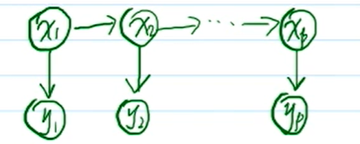

# 概率图模型
- PGM(概率图模型, probabilistic graphical model)
  - 离散型(随机变量)
    - 有向 贝叶斯网络(BN, bayesian network)
    - 无向 马尔科夫随机场(MN, markov network)
  - 连续型(随机变量) 高斯网络(GN, gaussian network)
    - 有向 高斯贝叶斯网络(GBN)
    - 无向 高斯马尔科夫随机场(GMN)
# 高斯网络

对于一个高斯网络，每个随机变量服从一个高斯分布$x_i \sim N(\mu_i, \Sigma_i)$
$X = (x_1, x_2, \cdots, x_T)$
对于每一个高斯网络都可以表示为一个高纬高斯分布的形式
$$p(X) = \frac{1}{(2\pi)^{\frac{p}{2}} |\Sigma|^{\frac{1}{2}}} \exp \left\{-\frac{1}{2} (x - \mu)^T\Sigma^{-1}(x - \mu)\right\}$$
协方差矩阵(**可以表达随机变量之间的独立性, 但是无法表达概率图模型中的条件独立性**: $x_i \perp x_j \Leftrightarrow \sigma_{ij} = 0$)
$$\Sigma = \left[\begin{array}{cccc}
\sigma_{11}  &\cdots  &\sigma_{1p}\\
\vdots  &\ddots  \\
\sigma_{p1}  &\cdots  &\sigma_{pp}\\
\end{array}\right]$$
精度矩阵(**precision matrix**, or,**information matrix**)(**可以表达概率图模型中可以表达 条件独立性**:  $x_A \perp x_B | x_C$)
$$\Lambda = \Sigma^{-1} = \left[\begin{array}{cccc}
\lambda_{11}  &\cdots  &\lambda_{1p}\\
\vdots  &\ddots &\vdots\\
\lambda_{p1}  &\cdots  &\lambda_{pp}\\
\end{array}\right]$$
$$x_i \perp x_j | - \left\{x_i, x_j\right\} \Leftrightarrow \lambda_{ij} = 0$$
# GBN(高斯贝叶斯网络)

高斯贝叶斯网络，以局部视角(local model)来看，又是**线性高斯模型**；全局视角(global model)称为**高斯贝叶斯网络**.也可以说高斯贝叶斯网络基于线性高斯模型
-  线性高斯模型回顾
$$
\begin{aligned} 
\left\{\begin{array}{c}p(x) = N(x|\mu_x, \Sigma_x) \\
p(y|x) = N(y|A x + b, \Sigma_y)\\
\end{array}\right.
\end{aligned}
$$
- Kalman Filter vs GBN

$$
\begin{aligned} 
& \left\{\begin{array}{c}p(x_t| x_{t-1}) = N(x_t|A x_{t-1} +B, Q) \\
p(y_t| x_{t}) = N(y_t|C x_{t} + D, R) \\
\end{array}\right.\\
& \text{随机变量形式}\\
& \left\{\begin{array}{c}x_t = A x_{t-1} + B + \varepsilon, \varepsilon \sim N(0, Q) \\
y_t = C x_{t} + D + \sigma , \sigma \sim N(0, R) \\
\end{array}\right.\\
\end{aligned}
$$
对于 kalman filter 对于每个隐状态只有一个父节点，我们可以将其看作特殊情况的高斯贝叶斯网络（每个节点由多个父节点）
## 高斯贝叶斯网络(GBN)
随机变量联合概率表示形式
$$\begin{aligned}
&p(x) = \prod_{i=1}^p p(x_i|x_{pa(i)}), x_{pa(i)} = (x_1, x_2, \cdots, x_k)^T \\
&p(x_i|x_{pa(i)}) = N(x_i|\mu_i + \bold{w}_i^T x_{pa(i)}, \sigma_i^2)\\
&这里写作 x_j - \mu_j, 所有的高斯分布都表示为了\\
&以0为均值的高斯分布，主要是为了简化模型.\\
&也可以直接写为 x_i = \sum_{j \in x_{pa(i)}} w_{ij} x_j + \sigma_i \varepsilon_i\\
&x_i = \mu_i + \sum_{j \in x_{pa(i)}} w_{ij}(x_j - \mu_j) + \sigma_i \varepsilon_i , \varepsilon_i \sim N(0, 1)\\
&x_i -  \mu_i = \sum_{j \in x_{pa(i)}} w_{ij}(x_j - \mu_j) + \sigma_i \varepsilon_i \\
& 令\\
& \boldsymbol{\mu} = [u_1, u_2, \cdots, u_p]^T\\
& \bold{w} = [w_{ij}]_{p \times p}\\
& \bold{x} = [x_1, x_2, \cdots, x_p]^T\\
& \boldsymbol{\varepsilon} = [\varepsilon_1, \varepsilon_2, \cdots, \varepsilon_p]^T\\ 
& \boldsymbol{s} = diag(\sigma_i)\\
& 上式可以表达为矩阵形式(对所有随机变量)\\
& \bold{x} - \boldsymbol{\mu} = \bold{w}(\bold{x} - \boldsymbol{\mu}) + \boldsymbol{s} \boldsymbol{\varepsilon}\\
& (\boldsymbol{I} - \boldsymbol{w})(\bold{x} - \boldsymbol{\mu}) = \boldsymbol{s} \boldsymbol{\varepsilon}\\
& (\bold{x} - \boldsymbol{\mu}) = (\boldsymbol{I} - \boldsymbol{w})^{-1}\boldsymbol{s} \boldsymbol{\varepsilon}\\
& 与协方差的联系\\
& \Sigma = cov(\bold{x}) = cov(\bold{x} -\boldsymbol{\mu}) = cov((\boldsymbol{I} - \boldsymbol{w})^{-1}\boldsymbol{s} \boldsymbol{\varepsilon})\\
\end{aligned}$$
## 高斯马尔科夫网络(GMN)
多维高斯分布概率密度表达如下
$$p(X) = \frac{1}{(2\pi)^{\frac{p}{2}} |\Sigma|^{\frac{1}{2}}} \exp \left\{-\frac{1}{2} (x - \mu)^T\Sigma^{-1}(x - \mu)\right\}$$
无向图概率密度表示形式
$$
p(x) = \frac{1}{z}\prod^{p}_{i=1} \underbrace{\psi_i(x_i)}_{\text{node potential}} \prod_{i, j \in x} \underbrace{ \psi_{i,j}(x_i, x_j)}_{\text{edge potential}}
$$
多维高斯分布 与 无向图 概率密度之间的联系
$$
\begin{aligned}
 p(x) &\propto \exp \left\{-\frac{1}{2} (x - \mu)^T\Sigma^{-1}(x - \mu)\right\}\\
& = \exp \left\{-\frac{1}{2} (x - \mu)^T \Lambda (x - \mu)\right\}\\
& = \exp  \left\{ -\frac{1}{2} (x^T \Lambda - \mu^T \Lambda) (x - \mu)\right\}\\
& = \exp  \left\{ -\frac{1}{2} (x^T \Lambda x - \mu^T \Lambda x - x^T \Lambda \mu + \mu^T \Lambda \mu)\right\}\\
& = \exp  \left\{ -\frac{1}{2} (x^T \Lambda x - 2 \mu^T \Lambda x + \mu^T \Lambda \mu)\right\}\\
& \propto \exp  \left\{ -\frac{1}{2} (x^T \Lambda x - 2 \mu^T \Lambda x)\right\}\\
& \propto \exp  \left\{ -\frac{1}{2}x^T \Lambda x + \mu^T \Lambda x\right\}\\
& \propto \exp  \left\{ \underbrace{-\frac{1}{2}x^T \Lambda x}_{二次} + \underbrace{(\Lambda \mu)^T x}_{一次}\right\}\\
& \text{记 potential vector: } \Lambda \mu  = \left[\begin{array}{c} h_1\\h_2\\\vdots \\ h_n\end{array}\right]\\
& x_i : - \frac{1}{2} \lambda_{ii} x_{i}^2 + h_i x_i\\
& x_i\ x_j : - \frac{1}{2}(\lambda_{ij} x_i x_j + \lambda_{ji} x_j x_i) = - \lambda_{ij} x_i x_j\\
& \text{可以将势函数与其作如下联系}\\
& \psi(x_i) = - \frac{1}{2} \lambda_{ii} x_{i}^2 + h_i x_i\\
& \psi(x_i, x_j) = - \lambda_{ij} x_i x_j\\
& 做如下分析:\\
& 若 \lambda_{ij} = 0, 则 x_i, x_j 不存在 \text{edge potential}, \lambda_{ij} 表示了 x_i, x_j 是否存在边。\\
& 即 \lambda_{ij} = 0 \Rightarrow x_i \perp x_j | -\{x_i, x_j\}\\
& 也即是，高斯网络在学习过程中同样会学习\bold{网络的结构}
\end{aligned}
$$
高斯马尔科夫网络几种重要结论
- $x_i \perp x_j \Leftrightarrow \sigma_{ij} = 0 $, marginal independent 绝对独立, 但是**无法表达在概率图中十分重要的条件独立**。
- $x_i \perp x_j|-\{x_i, x_j\} \Leftrightarrow \lambda = 0$, 条件独立性
- $\forall x_i, x_i | -{x_i} \sim N(\sum_{j \not = i} \frac{\lambda_{ij}}{\lambda_{ii}} x_j, \lambda_{ii}^{-1})$, $x_i$ 可以看作与其相关的随机变量的线性组合
  - 推导可能用到的公式 $\Lambda = \Sigma^{-1} = \left(\begin{aligned}\Sigma_{aa} \Sigma_{ab}\\
  \Sigma_{ba} \Sigma_{bb} \end{aligned}\right)^{-1}$ 分块矩阵求逆
  - woodbury formula (A - BCD)^{-1}
  - schur complementary