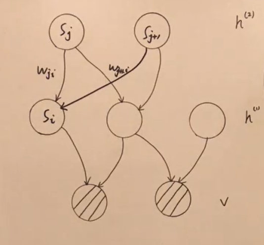
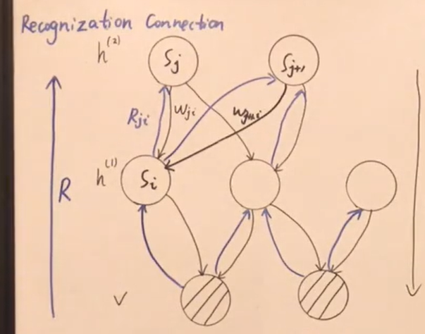

[toc]
# 主要思想
sigmoid belief network 属于贝叶斯网络，有线图模型。
结合了 玻尔兹曼机和有向图模型(有向图模型具有一些好的性质：采样简单)
(2) 该网络每个节点都是二值分布，只要网络层数足够多，可以逼近任何二值分布。
# 模型定义

$$
\begin{aligned}
&p(s_i = 1| s_j: j < i) = \sigma(\sum_{j < i} w_{ji}s_j )\\
&p(s_i = 0| s_j: j < i) = 1 - p(s_i = 1)  = \sigma(- \sum_{j < i} w_{ji}s_j )\\
&\text{综上}\\
&p(s_i| s_j: j < i) = \sigma(s_i^{*}\sum_{j < i} w_{ji}s_j), s^{*} = 2s_i -1
\end{aligned}
$$
存在的问题：
观测变量已知，后验分布难求的问题
# log-likelihood 梯度问题
$$
\begin{aligned}
& P(s_i|s_j:j < i) = \sigma(s_i^{*} \sum_{j < i}w_{ji}s_j)\\
& P(s) = \prod_{i} P(s_i|s_j:j < i) = P(v, h)\\
\end{aligned}
$$
log-likelihood: $\sum_{v \in V} \log P(v)$
$$
\begin{aligned}
\frac{\partial \log P(v)}{\partial w_{ji}} & = \frac{1}{P(v)} \frac{\partial P(v)}{\partial w_{ji}}\\
 & = \frac{1}{P(v)} \frac{\partial \sum_h P(v, h)}{\partial w_{ji}}\\
 & = \sum_h \frac{1}{P(v)} \frac{\partial  P(v, h)}{\partial w_{ji}}\\
 & = \sum_h \frac{P(h|v)}{P(h, v)} \frac{\partial  P(v, h)}{\partial w_{ji}}\\
 & = \sum_h P(h|v) \frac{1}{P(s)} \frac{\partial  P(s)}{\partial w_{ji}}\\
 & = \sum_h P(h|v) \frac{1}{{\Delta_{\sigma} P(s_k|s_j: j < k)}} \frac{\Delta_{\sigma} \partial P(s_k|s_j: j < k)}{\partial w_{ji}}\\
 & = \sum_h P(h|v) \frac{1}{{ P(s_i|s_j: j < i)}} \frac{ \partial P(s_i|s_j: j < i)}{\partial w_{ji}}\\
 & = \sum_h P(h|v) \frac{1}{\sigma(s_i^{*} \sum_{j < i}w_{ji}s_j)} \frac{ \partial \sigma(s_i^{*} \sum_{j < i}w_{ji}s_j)}{\partial w_{ji}}\\
 & \because \sigma^{'}(x) = \sigma(x) \sigma(-x)\\
 & = \sum_h P(h|v) \frac{1}{\sigma(s_i^{*} \sum_{j < i}w_{ji}s_j)} \sigma(- s_i^{*} \sum_{j < i}w_{ji}s_j) \sigma(s_i^{*} \sum_{j < i}w_{ji}s_j) s_i^{*} s_j \\
 & = \sum_h P(h|v)  \sigma(- s_i^{*} \sum_{j < i}w_{ji}s_j)  s_i^{*} s_j \\
\end{aligned}
$$
所以
$$
\begin{aligned}
&\frac{\partial }{\partial w_{ji}} \sum_{v \in V}\log P(v) = \sum_{v \in V}\frac{\partial }{\partial w_{ji}} \log P(v)  \\
& =\sum_{v \in V} \sum_h P(h|v)  \sigma(- s_i^{*} \sum_{j < i}w_{ji}s_j)  s_i^{*} s_j \\
&s = (h, v)\\
& =\sum_{v \in V} \sum_s P(s|v)  \sigma(- s_i^{*} \sum_{j < i}w_{ji}s_j)  s_i^{*} s_j \\
\end{aligned}
$$
由于 $p(s|v)$ 比较难求，所以需要使用采样方式获取，但是节点数较多，仍会有 采样时间 过长的问题。
$$
\begin{aligned}
\frac{\partial }{\partial w_{ji}} \sum_{v \in V}\log P(v) &= \sum_{v \in V} \sum_s P(s|v)  \sigma(- s_i^{*} \sum_{j < i}w_{ji}s_j)  s_i^{*} s_j \\
&= E_{s \sim P(s|v)}\left[\sigma(- s_i^{*} \sum_{j < i}w_{ji}s_j)  s_i^{*} s_j\right], s = (h, v)\\
\end{aligned}
$$
# 醒眠算法（wake sleep algorithm）
## 主要思想
引入了虚拟的连接$R_{ij}$, 用于迭代更新每个点的分布。
醒眠算法属于启发式算法。
## 醒眠算法主要流程

如果所示，分为两类 Recognization Connection 和 Generative Connection
wake phase(从下至上的逐层采样):
(1) Bottom-up 激活 neuron（获得各层样本)
(2) Learning Generative Connection（求 w)
sleep phase(从上至下的逐层采样):
(1) Top-down 激活 neuron (获得各层样本)
(2) Learning Recogization Connection（求 R)
## 醒眠算法优化目标
我们假定 $\theta = W$, $\psi = R$
### wake phase 
在该阶段，R 已知，逐层采样 W 未知，反向优化 w,
$$
\begin{aligned}
\hat{\theta} &= \arg \max_{\theta} E_{q_{\phi}(h|v)}\left[\log P_{\theta}(h, v)\right], \phi \text{ is fixed.}\\
&= \arg \max_{\theta} L(\theta)
\end{aligned}
$$
### Sleep phase
$$
\begin{aligned}
\hat{\phi} &= \arg \max_{\phi} E_{P_{\theta}(h, v)}\left[\log q_{\phi}(h|v) \right]\\
&= \arg \max_{\phi} \int P_{\theta}(h, v) \log q_{\phi}(h|v)dh\\
&= \arg \max_{\phi} \int P_{\theta}(v) P_{\theta}(h|v) \log q_{\phi}(h|v)dh\\
&= \arg \max_{\phi} P_{\theta}(v) \int  P_{\theta}(h|v) \log q_{\phi}(h|v)dh\\
&= \arg \max_{\phi} \int  P_{\theta}(h|v) \log q_{\phi}(h|v)dh\\
&= \arg \max_{\phi} \int  P_{\theta}(h|v) \log \left[\frac{q_{\phi}(h|v)}{P_{\theta}(h|v)} P_{\theta}(h|v) \right] dh\\
&= \arg \max_{\phi} \int  P_{\theta}(h|v) \log \left[\frac{q_{\phi}(h|v)}{P_{\theta}(h|v)}\right] + P_{\theta}(h|v) \log \left[P_{\theta}(h|v) \right]dh\\
&= \arg \max_{\phi} \int  P_{\theta}(h|v) \log \left[\frac{q_{\phi}(h|v)}{P_{\theta}(h|v)}\right] dh\\
&= \arg \max -KL\left[P_{\theta}(h|v)|| q_{\phi}(h|v)\right]\\
&= \arg \min KL\left[P_{\theta}(h|v)|| q_{\phi}(h|v)\right]\\
\end{aligned}
$$
### wake phase 与 sleep phase 对比
-  wake phase 从下至上 结合 training set 生成样本,优化目标为$\arg \max L(\theta)$
-  sleep phase 从上至下 优化参数，没有结合 training set 生成样本，优化目标为$ 
\arg \min KL\left[P_{\theta}(h|v)|| q_{\phi}(h|v)\right]$，容易造成较大偏差。