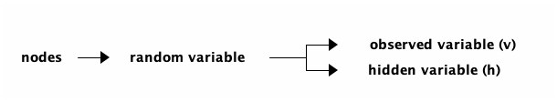
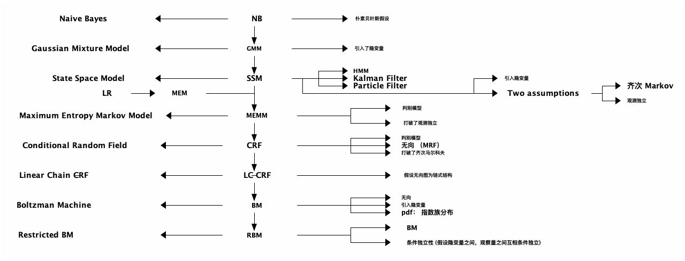

# 受限的玻尔兹曼机(RBM)
## 背景
Boltzman Machine(玻尔兹曼机): Markov RandomField with hidden nodes.

### 玻尔兹曼模型定义  
一个无向概率图模型中势函数取指数族分布，那么该模型为玻尔兹曼机，所服从的分布被称为 玻尔兹曼分布（Gibbs 分布）。

玻尔兹曼机因子分解:
$$
\begin{aligned}
P \left( x \right) &= \frac{1}{Z} \prod\limits_{ i=1 }^ { K }  \varphi \left( x_{c_i} \right)\\
&= \frac{1}{Z} \prod\limits_{ i=1 }^ { K } \exp \left\{ - E \left( x_{c_i} \right) \right\}\\
&= \frac{1}{Z} exp \left\{ - \sum\limits_{i=1}^K E \left( x_{c_i} \right) \right\}
\end{aligned}
$$
其中 $P(x) = \frac{1}{Z} \exp \left\{ -E \left( x \right) \right\}$ 为玻尔兹曼分布（Gibbs 分布）。

#### 玻尔兹曼分布
**玻尔兹曼分布最早来源于统计物理学.**
一个物理系统(包含多个粒子, 电子或原子)状态会如下公式所示:
$$
P \left( state \right) \propto \exp \left\{ - \frac{E}{k\cdot T} \right\}
$$
其中 $E$ 表示系统的能量函数.

### 概率图模型总结

#### 概率图模型的五大特点
1. 方向 (有向/无向)  ----- 边
2. 离散/连续/混合 ----- 点
3. 条件独立性强弱 (各种条件独立性假设) ----- 边
4. 隐变量 (是否包含隐变量) ----- 点
5. 概率密度函数 （是否是指数族分布) ----- 结构

## 核心思想
Boltzman Machine 难点在于 Inference, 精确推断 untrackable, 近似推断计算量又过于巨大。因此，我们将其简化, 假设h, v 之间有连接， h,v 内部无连接。
$$
\begin{aligned}
X &= \left (
\begin{array}{c}
x_{1} \\
x_2 \\
\dots \\
x_p
\end{array}
\right )  = \left (
\begin{array}{c}
h \\
v \\
\end{array}
\right ),
h = \left (
\begin{array}{c}
h_{1} \\
h_2 \\
... \\
h_m
\end{array}
\right )
,  v = \left (
\begin{array}{c}
v_{1} \\
v_2 \\
... \\
v_n
\end{array}
\right )
, m+n = p
\end{aligned}
$$
基于以上假设，可以简化 $p \left( x \right)$:
$$
\begin{aligned}
p \left( x \right) &= \frac{1}{Z} \exp \left\{ - E \left( x \right) \right\}\\
p \left( v, h \right) &= \frac{1}{Z} \exp \left\{ -E \left( v, h \right) \right\}\\
&= \frac{1}{Z} \exp \left\{ h^T w v + \alpha^T v + \beta^T h \right\}\\
&= \frac{1}{Z} \exp \left\{ h^T w v \right\} \exp \left( \alpha^T v \right) \exp \left ( \beta^T h \right )\\
\end{aligned}
$$
其中 $E \left( v, h \right) = - \left( h^T w v + \alpha^T v + \beta^T h \right)$ .

## RBM-Representation
$$
\begin{aligned}
\text{RBM's pdf } \rightarrow p \left( x \right) &= p \left( v, h \right) = \frac{1}{Z} \exp \left( h^T w v \right) \exp \left( \alpha^T v \right)\\
&= \frac{1}{Z} \prod\limits_{ i=1 }^ { m } \prod\limits_{ j=1 }^ { n } \exp \left( h_i w_{ij} v_j \right) \prod\limits_{ j=1 }^ { n } \exp \left( \alpha_j v_j\right) \prod\limits_{ i=1 }^ { m } \exp \left( \beta_i h_i \right)
\end{aligned}
$$
## RBM-Inference
#### 分解能量函数
$$
\begin{aligned}
E \left( h, v \right) &= - \left( \underbrace{\sum\limits_{i=1, i \neq l}^m \sum\limits_{j=1}^n h_i w_{ij} v_j}_{\Delta_1} + \underbrace{h_l \sum\limits_{j=1}^n w_{lj} v_j}_{\Delta_2} + \underbrace{\sum\limits_{j=1}^n \alpha_j v_j}_{\Delta_3} + \underbrace{\sum\limits_{i=1, i \neq l}^{n} \beta_i h_i}_{\Delta_4} + \underbrace{\beta_l h_l}_{\Delta_{5}} \right)\\
\Delta_2 + \Delta_5 &= h_l \left( \sum\limits_{j=1}^h w_{lj} v_j + \beta_l \right) = h_l \cdot H_l (v)\\
\bar{H} \left( h_t, v \right) &= \Delta_1 + \Delta_3 + \Delta_4\\
\therefore E \left( h, v \right) &= h_l \cdot H_l \left( v \right) + \bar{H}_l \left( h_{-l}, v \right)
\end{aligned}
$$
#### 推导 $p \left( h_l | v \right)$ 与 $p \left( v_l | h \right)$
设 $h_l \in \left\{ 0,1 \right\}$,
$$
\begin{aligned}
p \left( h_l = 1| v \right) &= p \left( h_l = 1 | h_{-l}, v \right) \\ 
&= \frac {p \left( h_l = 1 , h_{-l}, v \right)}{p \left( h_{-l}, v \right)}\\
&= \frac {p \left( h_l , h_{-l}, v \right)}{p \left( h_l = 0,  h_{-l}, v \right) + p \left( h_l = 1,  h_{-l}, v \right)} \\
&= \frac { \frac{1}{Z} \exp \left\{ H_l (v) + \bar{H} \left( h_{-l}, v \right) \right\} }{\frac{1}{Z} \exp \{ H_l (v) + \bar{H}_l \left( h_{-l}, v \right) \} + \frac{1}{Z} \exp \{\bar{H}_l \left( h_{-l}, v \right) \} } \\
&= \frac{1}{1+ \exp \left\{ - H_l (v) \right\} } = \sigma \left( H_l \left( v \right) \right) = \sigma \left( \sum\limits_{j=1}^n w_{lj} v_j + \beta_l  \right)
\end{aligned}
$$
$p \left( v_l | h \right)$ 同理。

#### 推导 $p(v)$
设 $h_l \in \left\{ 0,1 \right\}$,
$$
\begin{aligned}
p \left( v \right) &= \sum\limits_h P \left( h,v \right) = \sum\limits_h^{} \frac{1}{Z} \exp \left\{ -E \left( h, v \right) \right\} = \sum\limits_h^{} \frac{1}{Z} \exp \left\{ - \left( h^T W v + \alpha^T v + \beta^T h \right) \right\}\\
&= \frac{1}{Z} \sum\limits_{h_1}^{} ... \sum\limits_{h_m}^{} \exp \left\{ (h^T W v + \alpha^T v + \beta^T h) \right\}\\
&= \frac{1}{Z} \exp \left( \alpha^T v \right) \sum\limits_{h_1}^{} ... \sum\limits_{h_m}^{} \exp \left\{  h^T w v + \beta^T h \right\}\\
&= \frac{1}{Z} \exp \left( \alpha^T v \right) \sum\limits_{h_1}^{} ... \sum\limits_{h_m}^{} \exp \left\{ \sum\limits_{i=1}^m (h_i w_i v + \beta_i h_i) \right\}\\
&= \frac{1}{Z} \exp \left( \alpha^T v \right) \sum\limits_{h_1}^{} \exp \left\{ (h_1 w_1 v + \beta_1 h_1) \right\} ... \sum\limits_{h_m}^{} \exp \left\{ (h_m w_m v + \beta_m h_m) \right\}\\
&= \frac{1}{Z} \exp \left( \alpha^T v \right) (1 + \exp \left\{ w_1 v + \beta_1 \right\}) ... (1 + \exp \left\{ w_m v+ \beta_m \right\} )\\
&= \frac{1}{Z} \exp \left( \alpha^T v \right) \exp \log (1 + \exp \left\{ w_1 v + \beta_1 \right\}) ... \exp \log (1 + \exp \left\{ w_m v+ \beta_m \right\} )\\
&= \frac{1}{Z} \exp (\alpha^T v + \sum\limits_{i=1}^m \underbrace{\log \left( 1 + \exp \left( w_i v + \beta_i \right) \right)}_{softplus})\\
&= \frac{1}{Z} \exp \left( \alpha^T v + \sum\limits_{i=1}^m softplus (w_i v + \beta_i) \right)
\end{aligned}
$$
其中 $w_i$ 为 $w$ 的行向量.

## RBM-Learning
$$
\begin{aligned}
\left \{
\begin{array}{l}
P \left( h, v \right) = \frac{1}{Z} \exp \left\{ - E \left( h,v \right) \right\} \\
E \left( h, v \right) = - \left( h^T w v + \alpha^T v + \beta^T h \right)
\end{array}
\right. 
\end{aligned}
$$
### Inference $\log P \left( v \right)$ 
$$
\begin{aligned}
P \left( v \right) &= \log \sum\limits_h P \left( h,v \right) = \log \sum\limits_h \frac{1}{Z} \exp \left\{ -E \left( h,v \right) \right\}\\
&= \underbrace{ \log \sum\limits_{h} \exp \left\{ - E \left( h,v \right) \right\}}_{A} - \underbrace{\log \sum\limits_{h,v} \exp \left\{ -E \left( h,v \right) \right\}}_{B}
\end{aligned}
$$

### Inference $\log P(v)$'s Gradient 
$$
\begin{aligned}
\frac{\partial}{\partial \theta} \log P \left( v \right) &= \frac{\partial}{\partial \theta} A - \frac{\partial}{\partial \theta} B\\
&= \sum\limits_{h,v} P(h,v) \frac{\partial E \left( h,v \right)  }{\partial \theta } - \sum\limits_{h} P(h|v) \frac{\partial E \left( h,v \right)  }{\partial \theta }
\end{aligned}
$$
$$
\begin{aligned}
\frac{\partial}{\partial \theta} A &= \frac{\partial}{\partial \theta} \log \sum\limits_{h} \exp \left\{ -E \left( h,v \right) \right\} = - \frac{1}{\sum\limits_{h}{\exp \left\{ -E \left( h,v \right) \right\}}} \sum\limits_{h} \exp \left\{ -E \left( h,v \right) \right\} \frac{\partial E \left( h,v \right)}{\partial \theta}\\
&= - \sum\limits_{h} \frac{\frac{1}{Z} \exp \left\{ -E \left( h,v \right) \right\}}{\frac{1}{Z} \sum\limits_{h} \exp \left\{ - E \left( h,v \right) \right\} } \frac{\partial E \left( h,v \right)}{ \partial \theta} = - \sum\limits_h P \left( h | v \right) \frac{\partial E \left( h,v \right)}{\partial \theta}\\
\frac{\partial}{\partial \theta} B &= \frac{\partial}{\partial \theta} \log \sum\limits_{h,v} \exp \left\{ -E \left( h,v \right) \right\} = - \frac{1}{\sum\limits_{h,v}{\exp \left\{ -E \left( h,v \right) \right\}}} \sum\limits_{h,v} \exp \left\{ -E \left( h,v \right) \right\} \frac{\partial E \left( h,v \right)}{\partial \theta}\\
&= - \sum\limits_{h,v} \frac{\frac{1}{Z} \exp \left\{ -E \left( h,v \right) \right\}}{\frac{1}{Z} \sum\limits_{h,v} \exp \left\{ - E \left( h,v \right) \right\} } \frac{\partial E \left( h,v \right)}{ \partial \theta} = - \sum\limits_{h,v} P \left( h,v \right) \frac{\partial E \left( h,v \right)}{\partial \theta}
\end{aligned}
$$

### Inference log-likelihood and Gradient for RBM
Training set $v \in S, |S| = N$.
$$
\begin{aligned}
&\text{log-likelihood:}\\
&\frac{1}{N} \sum\limits_{v \in S}{\log P \left( v \right)}\\
&\text{log-likelihood gradient:}\\
& \frac{\partial}{\partial \theta} \frac{1}{N} \sum\limits_{v \in S} \log P \left( v \right)
\end{aligned}
$$
$$
\begin{aligned}
&\because E \left( h,v  \right) = - (h^T w v + \Delta) = - \left( \sum\limits_{i=1}^m \sum\limits_{j=1}^n h_i w_{ij} v_j + \Delta \right)\\
&\therefore \frac{\partial}{\partial w_{ij}} \log P \left( v \right) = -\sum\limits_h P \left( h|v \right) \frac{\partial E \left( h,v \right)}{\partial w_{ij}} + \sum\limits_{h,v} P \left( h,v \right) \frac{\partial E \left( h,v \right)}{ \partial w_{ij}}\\
& \qquad \qquad \qquad \qquad = - \sum\limits_h P \left( h|v \right) (- h_i v_j) + \sum\limits_{h,v} P \left( h,v \right) (-h_i v_j)\\
& \qquad \qquad \qquad \qquad = \underbrace{\sum\limits_{h} P \left( h | v \right) h_i v_j}_{A} - \underbrace{\sum\limits_{h,v} P \left( h,v \right) h_i v_j}_{B}
\end{aligned}
$$

**$h_i$ 非零即一**
$$
\begin{aligned}
A &= \sum\limits_{h_1} \sum\limits_{h_2} \sum\limits_{h_3} ... \sum\limits_{h_i} ... \sum\limits_{h_m} P \left( h_1, h_2, ...,h_i, ...,h_m | v \right) h_i v_j = \sum\limits_{h_i} P \left( h_i | v \right) h_i v_j \\
&= P \left( h_i = 1 | v \right) v_j\\
B &= \sum\limits_h \sum\limits_{v} P \left( v \right) P \left( h | v \right) h_i v_j = \sum\limits_{v} P \left( v \right) \sum\limits_h P \left( h | v \right) h_i v_j \\
&= \sum\limits_{v} P \left( v \right) P \left( h_i = 1 | v  \right) v_j
\end{aligned}
$$

### k-CD for RBM
$$
\begin{aligned}
&For each v \in S:\\
&\qquad    v^{(0)} \leftarrow v\\
&\qquad\qquad    For \quad l=0,1,2,...,k-1:(k steps block Gibbs Sampling)\\
&\qquad \qquad \qquad For \quad i = 1,2,...,m:\\
&\qquad \qquad \qquad \qquad sample\quad h_i^{(l)} \sim P \left( h_i | v^{(l)} \right)\\
&\qquad \qquad \qquad For \quad j = 1,2,...,n:\\
&\qquad \qquad \qquad \qquad sample \quad v_j^{(l+1)} \sim P \left( v | h^{(l)} \right)\\
&\qquad \qquad \qquad For \quad i = 1,2,...,m; j=1,2,...,n:\\
&\qquad \qquad \qquad \qquad \Delta w_{ij} \leftarrow \Delta w_{ij} + \frac{\partial}{\partial w_{ij}} \log P \left( v \right) = P \left( h_i = 1 | v^{(0)} \right) v_j^{(0)} - P \left( h_i = 1 | v^{(k)} \right) v_j^{(k)}
\end{aligned}
$$
Block Gibbs Sampling 流程:

利用 k-CD 而非 梯度上升法的主要原因是梯度公式中的 $\sum\limits_{v} P \left( v \right) P \left( h_i = 1 | v  \right) v_j$ 部分计算过于复杂.
因此需要使用 Gibbs Sampling 算法对 $\sum\limits_{v} P \left( v \right) P \left( h_i = 1 | v  \right) v_j = E_{P(v)}[P \left( h_i = 1 | v \right) v_j ]$ 进行求解.

