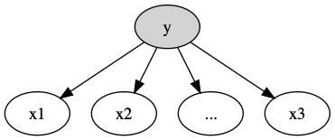

# 朴素贝叶斯分类器 (Naive Bayes Classifier)
## 核心思想
朴素贝叶斯思想， 条件独立性假设, 最简单的概率图模型 (有向图)。
## 问题定义
数据的表示形式为：
$$
\left\{\left(x_{i}, y_{i}\right)\right\}_{i=1}^{N}, x_{i} \in \mathbb{R}^{p}, y_{i} \in\{0,1\}
$$
## 概率图

$$
\begin{aligned}
&y\in \left\{ 0,1 \right\} \quad x\in \mathbb{R}^{P}\\ 
&x_{i} \perp x_{j} | y_{i}(i+j)\\
&P \left( x | y \right)  = \prod_{j=1}^p P \left( x_j | y \right)
\end{aligned}
$$
## 推导
### 预测模型
我们最终预测模型为:
$$
 \hat{y} = \arg \max_{y\in \left\{ 0,1 \right\}} P \left( y|x \right)
$$

### 优化目标
- y 服从的分布
  + 当问题为二分类的时候， 我们假设 $y\sim Bernoulli \quad Dist$.
  + 当问题为多分类的时候， 我们假设 $y\sim Categorial \quad Dist$.
- $x|y$ 服从的分布
  + 当 $x$ 为离散型变量的时候， $x_j|y \sim Categorical \quad Dist$.
  + 当 $x$ 为连续性变量的时候， $x_j|y \sim \mathcal{N} \left( \mu_j, \sigma_{j} \right)$.

朴素贝叶斯模型 likehood 可以表示为如下形式:
$$
\begin{aligned}
\hat{\theta} &= \arg \max_{\theta} P \left( y|x \right)\\
&= \arg \max_{\theta} \frac{P \left( x,y \right)}{P \left( x \right)}\\
&= \arg \max_{\theta} P \left( y \right) P \left( x | y \right)
\end{aligned}
$$
根据 $x$ 与 $y$ 的类型选择合适的分布进行推导。

