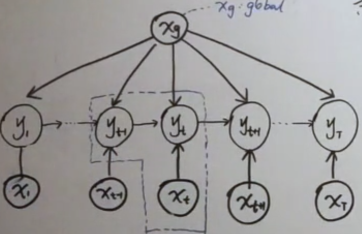
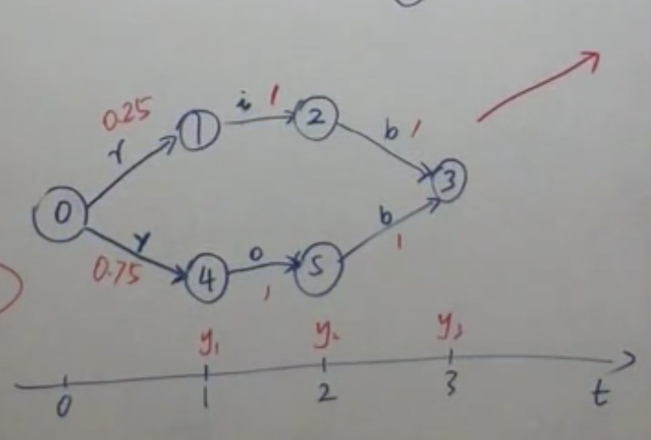

[toc]
# Conditional Random Field (条件随机场)
## 背景
- 分类问题
  - 硬分类
    - 支持向量机(SVM, Support Vector Machine, 几何间隔) 
    - 感知机(PLA, Perceptron Learning ALgorithm, $f(w) = sign(w^Tx)$, 错误驱动的思想)
    - 线性判别分析(LDA linear discriminant analysis, 类间大，类内小)
  - 软分类
    - 概率判别模型
      - 逻辑回归 (Logistic Regression) 逻辑回归为对数线性模型。
对数线性模型是解决分类问题的**最大熵模型(Maximum Entropy Model)**。
        - 最大熵思想
让未知信息熵最大的分布为**指数族分布**。 (例如，给定均值与方差的情况下，熵最大的分布为**高斯分布**)。
    - 概率生成模型
      - 朴素贝叶斯分类器 (Naive Bayes Classifier) 
        - 朴素贝叶斯假设(给定标签，特征之间相互独立, $x_i \perp x_j | y$)
      - 高斯混合模型 
        - 隐变量必须是离散变量
      - 隐马尔科夫模型 (Hidden Markov Model)
        - 假设
          - 齐次马尔科夫假设
          - 观测独立假设 (朴素贝叶斯假设 隐变量对应于朴素贝叶斯中的y，观察量对应于x)
        - **隐变量必须是离散变量**, 观测变量可以是连续的，也可以是离散的 
可以看做高斯混合模型在随机变量序列上的拓展
## MEMM (Maximum Entropy Markov Model)
### 核心思想
MEMM 为结合 **最大熵原理** 与 **隐马尔科夫模型 (Hidden Markov Model)** 提出的模型。
打破了 HMM 的观测独立假设, 使得模型假设更为合理。
### 模型推导

#### 建模对象
$$
P \left( Y | X, \lambda \right) = \prod\limits_{ t=1 }^ { T } P \left( y_t | y_{t-1}, x_{1:T}, \lambda \right)
$$
由概率图模型以及 **D划分** 可知，当 $y_t$ 被观测的情况下， $x_t$ 与 $x_{t-1}$ 并不独立。
#### HMM 建模对象
$$
P \left( X, Y | \lambda \right) = \prod\limits_{ t=1 }^ { T } P \left( y_t | y_{t-1}, \lambda \right) P \left( x_t | y_t ,\lambda \right)
$$
当 $y_t$ 被观测的情况下， $x_t$ 与 $x_{t-1}$ 互相独立。

#### MEMM 优点与缺点
- 优点
1. 相比于HMM，其为判别模型对于 decoding 问题表达更为简洁。
2. MEMM 打破了 HMM 中的观测独立假设
- 缺点
由于有向概率图局部归一化导致的 **label bias Problem**.从概率图角度，在计算 $y_t$ 的时候 $x_t$ 与 $x_{t+1}$ 是相互独立的， $y_t$ 的结果仅仅受到 $x_{1,...t}$ 的影响而未受到 $x_{t+1,...T}$ 的影响。

从计算角度看， 问题体现在在每个时刻都要进行归一化求解当前时刻的概率 (局部归一化)。 对于每个 $y_t$ 选取的是当前时刻的最优解，而不是选取全局最优解。
如上图所示，当结果输入为 rib， P(Y|rib) = 0.7, Y = 0453, 然而 0453 对应的训练数据为 rob.
## 讨论
（1） MEMM 放弃了 HMM 的 观测独立的强假设，所以对于单个隐变量来讲，存储的信息减少了，降低对模型的要求。相对来讲，HMM在确定了单个隐变量后，对应的观测变量独立于其他观测变量。也即是HMM对单个隐变量的要求较高，需要包含大量信息。
（2）LSTM,GRU 与 HMM 模型的对比，LSTM的隐状态更加复杂，可以保留更多的信息。

## 核心思想
条件随机场，条件体现在其为判别模型， 随机场体现在其为无向图模型。
**无向图模型的主要目的是为了解决 label bias problem。**
## Chain-structure CRF 概率密度函数

### 概率密度函数数学表达
$$
\begin{aligned}
P (Y|X) &= \frac{1}{Z} \exp \sum\limits_{i=1}^K F_i (x_{c_i})\\
&= \frac{1}{Z} \exp \sum\limits_{t=1}^T F_t \left( y_{t-1}, y_t, x_{1:T} \right)\\
&= \frac{1}{Z} \exp \sum\limits_{t=1}^T F \left( y_{t-1}, y_t, x_{1:T} \right)\\
&= \frac{1}{Z} \exp \sum\limits_{t=1}^T \left[ \sum\limits_{k=1}^K \lambda_k f_k \left( y_{t-1}, y_t, x_{1:T} \right) + \sum\limits_{l=1}^L \eta_l g_l \left( y_t, x_{1:T} \right) \right]
\end{aligned}
$$
$$
\begin{aligned}
F \left( y_{t-1}, y_t, x_{1:T} \right) &= \Delta_{y_{t-1},x_{1:T}} + \Delta_{y_t, x_{1:T}} + \Delta_{y_{t-1},y_t, x_{1:T}}\\
&= \Delta_{y_t, x_{1:T}} + \Delta_{y_{t-1}, y_t, x_{1:T}}
\end{aligned}
$$
其中 $\Delta_{y_t, x_{1:T}}$ 为状态函数， $\Delta_{y_{t-1}, y_t, x_{1:T}}$ 为转移函数。
$$
\begin{aligned}
\Delta_{y_{t-1}, y_t, x_{1:T}} &= \sum\limits_{k=1}^K \lambda_k f_k \left( y_{t-1}, y_t, x_{1:T} \right)\\
\Delta_{y_t, x_{1:T}} &= \sum\limits_{l=1}^L \eta_l g_l \left( y_t, x_{1:T} \right) 
\end{aligned}
$$
其中 $f_k$, $g_l$ 为给定的特征函数 (其值为1或者0),  $\lambda_k$, $\eta_l$ 为参数。
### 概率密度函数向量表示
$$\begin{aligned}
&P(Y | X ) = \frac{1}{Z} \exp \sum\limits_{t=1}^T \left[ \sum\limits_{k=1}^K \lambda_k f_k \left( y_{t-1}, y_t, x_{1:T} \right) + \sum\limits_{l=1}^L \eta_l g_l \left( y_t, x_{1:T} \right) \right]\\
&P(Y = y | X = x)= \frac{1}{Z(x,\lambda,\eta)} \exp \sum\limits_{t=1}^T \left[ \lambda^T f(y_{t-1}, y_t, x) + \eta^T g \left( y_t, x \right) \right]
\end{aligned}
$$
其中
$$
\begin{aligned}
y=\left(\begin{array}{l}
y_{1} \\
y_{2} \\
\vdots \\
y_{7}
\end{array}\right) \quad x=\left(\begin{array}{c}
x_{1} \\
x_{2} \\
\vdots \\
x_{1}
\end{array}\right) \quad \lambda=\left(\begin{array}{c}
\lambda_{1} \\
\lambda_{2} \\
\vdots \\
\lambda_{k}
\end{array}\right) \quad \eta=\left(\begin{array}{c}
n_{1} \\
\eta_{2} \\
\vdots \\
\eta_{L}
\end{array}\right) f=\left(\begin{array}{c}
f_{1} \\
f_{2} \\
\vdots \\
f_{k}
\end{array}\right)=f\left(y_{t-1}, y_{t}, x\right) \quad g=\left(\begin{array}{c}
g_{1} \\
g_{2} \\
\vdots \\
g_{c}
\end{array}\right)=g\left(y_{t}, x\right)
\end{aligned}
$$

再令 $\theta = \left ( \begin{array}{c} \lambda \\ \eta \end{array} \right )_{K+L}, H = \left ( \begin{array}{c} \sum\limits_{t=1}^T f (y_{t-1}, y_t, x) \\ \sum\limits_{t=1}^T g (y_{t}, y_t, x) \\ \end{array} \right )$, 最终概率密度函数变为
$$
P \left( Y= y | X= x \right) = \frac{1}{Z(x,\theta)} \exp (\theta^T H)
$$
### MRF 因子分解
$$
\begin{aligned}
&\varphi \left( x_{c_i} \right) = \exp \left\{ -E \left( x_{c_i} \right) \right\}\\
&E \left( x_{c_i} \right) \text { is energy function.}
\end{aligned}
$$

$$
\begin{aligned}
P \left( x \right) &= \frac{1}{Z} \prod\limits_{ i=1 }^ { K }  \varphi \left( x_{c_i} \right)\\
&= \frac{1}{Z} \prod\limits_{ i=1 }^ { K } \exp \left\{ - E \left( x_{c_i} \right) \right\}\\
&= \frac{1}{Z} exp \left\{ - \sum\limits_{i=1}^K E \left( x_{c_i} \right) \right\}
\end{aligned}
$$

## Inference
假定参数已经全部求得
### $P \left( y_t | X \right)$ 推导
给定 $P \left( Y = y | X = x \right)$, 求 $P \left( y_t = i | x \right)$.
$$
P \left( y|x \right) = \frac{1}{Z} \prod\limits_{t=1}^{T} \phi (y_{t-1}, y_t, x)
$$
$$
\begin{aligned}
P \left( y_t = i | x \right) &= \sum\limits_{y_1, y_2, ..., y_{t-1}, y_t} P \left( y|x \right)\\
&= \sum\limits_{y<1,t-1>} \sum\limits_{y <t+1,T>} \frac{1}{Z} \prod\limits_{ t' = 1 }^ { T } \phi (y_{t'-1}, y_{t'}, x) \\
&= \frac{1}{Z} \sum\limits_{y<1:t-1>} \phi_1 \left( y_0, y_1, x \right) \phi_2 \left( y_1, y_2, x \right) ... \phi_{t-1} \left( y_{t-2}, y_{t-1}, x  \right) \phi_t \left( y_{t-1}, y_t = i, x \right)\\
&= \frac{1}{Z} \sum\limits_{y<1:t-1>} \phi_1 \left( y_0, y_1, x \right) \phi_2 \left( y_1, y_2, x \right), ..., \phi_{t-1} \left( y_{t-2}, y_{t-1}, x \right) \phi_t \left( y_{t-1}, y_t = i, x \right)  \sum\limits_{y<t+1,T>} \phi_{t+1} \left( y_t = i, y_{t+1}, x \right), ..., \phi_T \left( y_{T-1}, y_T, x \right)\\
&= \frac{1}{Z} [\sum\limits_{y_{t-2}} \phi_{t-1} \left( y_{t-2}, y_{t-1}, x \right) ... \sum\limits_{y_{1}} \phi_2 (y_1, y_2, x) \sum\limits_{y_0} \phi_1 \left( y_0, y_1, x \right)]
[\sum\limits_{y_{T}} \phi_{T} (y_{T-1}, y_{T}, x) \sum\limits_{y_{T-1}} \phi_{y_{T-1}}(y_{T-2},y_{T-1},x) ... \sum\limits_{y_{t+1}} \phi_{y_{t+1}} (y_{t},y_{t+1}, x)]\\
&= \frac{1}{Z} \alpha_t(i) \beta_t(i) 
\end{aligned}
$$
$$
\begin{aligned}
\alpha_t (i) = \sum\limits_{j \in S} \phi_t (y_{t-1} = j, y_t = i, x) \alpha_{t-1} (j)\\
\beta_t (i) = \sum\limits_{j \in S} \phi_t (y_{t-1} = i, y_t = j, x) \beta_{t+1} (j)
\end{aligned}
$$
其中 $\alpha_t(i)$ 表示 $y_0, y_1, y_2, ..., y_{t-1}$ 的所有势函数与 $y_t = i$ 的左半部分势函数, 其中 $\beta_t(i)$ 表示 $y_{t+1}, y_{t+2}, ..., y_{T}$ 的所有势函数与 $y_t = i$ 的左半部分势函数。

## Learning
### 优化目标
$$
\begin{aligned}
\hat{\theta} &= \arg \max \prod\limits_{ i=1 }^ { N } P \left( y^{(i)} | x^{(i)} \right) \\
\hat{\lambda}, \hat{\eta} &= \arg \max_{\lambda, \eta} \prod\limits_{ i=1 }^ { N } P \left( y^{(i)} | x^{(i)} \right)\\
&= \arg \max_{\lambda, \eta} \log \prod\limits_{ i=1 }^ { N } P \left( y^{(i)} | x^{(i)} \right) = \arg \max_{\lambda, \eta} \sum\limits_{i=1}^N \log P \left( y^{(i)} | x^{(i)} \right)\\
&= \arg \max_{\lambda, \eta} \sum\limits_{i=1}^N \left( -\log Z(x^{(i)},\lambda, \eta) + \sum\limits_{t=1}^T \left[ \lambda^T f \left( y_{t-1}, y_t, x^{(i)} \right) + \eta^T g \left( y_t, x^{(i)} \right) \right] \right)\\
&= \arg \max_{\lambda,\eta} L \left( \lambda, \eta, x^{i} \right)
\end{aligned}
$$
其中 N: size of training data, $P(y | x ) = \frac{1}{Z(x,\lambda,\eta)} \exp \sum\limits_{t=1}^T \left[ \lambda^T f \left( y_{t-1}, y_t, x \right) + \eta^T g \left( y_t, x \right)  \right]$.
### 参数求解
$$
\begin{aligned}
\nabla_{\lambda} L &= \sum_{i=1}^{N}\left[\sum_{t=1}^{T} f\left(y_{t+1}, y_{t}, x^{(i)}\right)-\nabla_{\lambda} \log Z\left(x^{(i)}, \lambda, \eta\right)\right]\\
\nabla_{\lambda} \log Z(x^{(i)}, \lambda, \eta) &= E \left[ \sum\limits_{t=1}^T f \left( y_{t-1}, y_t, x^{(i)} \right) \right]\\
&=\sum_{y} P\left(y | x^{(i)}\right) \cdot \sum_{t=1}^{T} f\left(y_{t-1}, y_{t}, x^{(i)}\right) \\
&=\sum_{t=1}^{T}\left(\sum_{y} P\left(y | x^{(i)}\right) \cdot f\left(y_{t-1}, y_{t}, x^{(i)}\right)\right)\\
&=\sum_{t=1}^{T} \sum_{y<1:t-2>} \sum_{y_{t-1}} \sum_{y_{t}} \sum_{y<t+1,T>} P\left(y | x^{(i)}\right) \cdot f(y_{t-1}, y_{t}, x^{(i)})\\
&= \sum_{t=1}^{T} \sum_{y_{t-1}} \sum_{y_{t}}\left(\sum_{y<1,t-2>} \sum_{y<t+1,T>} p\left(y | x^{(t)}\right) f(0)\right) \\
&= \sum_{t=1}^{T} \sum_{y_{t-1}} \sum_{y_{t}} p\left(y_{t-1}, y_{t}, x^{(i)}\right) f\left(y_{t-1}, y_{t}, x^{(i)}\right)\\
&= \sum_{t=1}^{T} \sum_{y_{t-1}} \sum_{y_{t}} A(y_{t-1}, y_t) f\left(y_{t-1}, y_{t}, x^{(i)}\right)
\end{aligned}
$$

