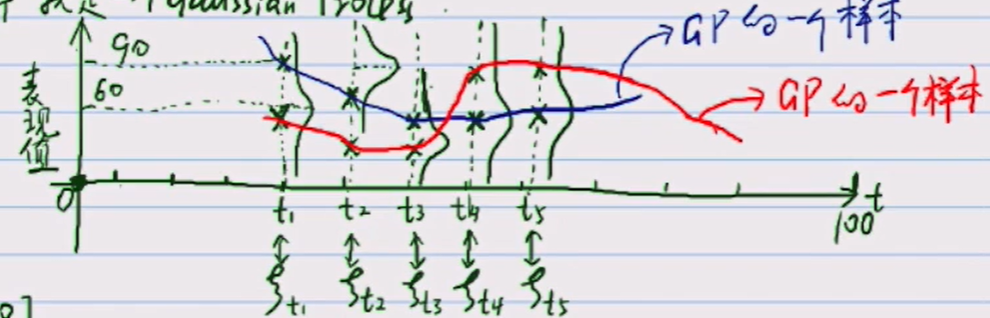

[toc]
# 高斯过程
主要包含两个要素，高斯分布，和 随机过程
## 高斯分布的分类
- 一维高斯分布 
$p(x) = N(\mu, \sigma^2)$
- 多维高斯分布 
$p(x) = N(\mu, \Sigma), x \in \mathcal{R}^p, p < + \infty$
多维高斯分布可以对应一个[高斯网络](./高斯网络.md)
- 无限维高斯分布
无限维高斯分布可以表示一个高斯过程(Guassian Process)
高斯过程 是定义在连续域上的无限多个高斯随机变量所组成的随机过程
## 高斯过程图解

每一个时间点 t 都对应一个随机变量 $\xi_{t}$, 而每一随机变量 $\xi_{t}$ 都服从一个高斯分布$N(\mu_{t}, \sigma_{t}^2)$
图中，红线，蓝线分别表示在$t$个时刻不断采样得到的两个不同的样本。
高斯过程严格定义
$\left\{\xi_t\right\}_{t \in T}$, T 属于一个连续域。如果$\forall n \in N^{+}, t_1, t_2, \cdots, t_n \in T, s.t. \left\{\xi_{t_1}, \xi_{t_2}, \cdots, \xi_{t_n}\right\} \triangleq \left\{\xi_{t_1  - t_n}\right\}$, 那么称 $\left\{\xi_t\right\}_{t \in T}$ 为 高斯过程
一般来讲, 对于一个高斯过程，每一时刻的高斯分布的均值，方差都被确定.高斯过程被两个函数确定，一个是均值函数 $m(t) = E[\xi_t]$, 协方差 函数 $k(s, t) = E[(\xi_s - m(s))(\xi_t - m(t))^T]$
# 高斯过程回归
## 权重空间角度
### 贝叶斯线性回归
- $p(w|Data) = N(w|\mu_w, \Sigma_w)$
$$
\begin{aligned}
\mu_w &= \sigma^{-2} A^{-1} X^T Y\\
\Sigma_w &= A^{-1}\\
A &= \left( \sigma^{-2} x^T x + \Sigma_p^{-1} \right)\\
\end{aligned}
$$
- 给定 $x^{*}$, $y^{*}$ 的预测
$$
\begin{aligned}
&\text{无噪声}\\
&p(f(x^{*})| Data, x^{*}) = N(x^{*T} \mu_w, x^{*T}\Sigma_w x^{*})\\
&\text{高斯噪声}\\
&p(y^{*}|Data, x^{*}) = N(x^{*T} \mu_w, x^{*T}\Sigma_w x^{*} + \sigma^2)\\
\end{aligned}
$$
### 原始问题非线性
如果问题本身无法用线性回归解决，只有使用SVM的核方法的思想，将低维空间的向量映射到高位空间，使其变得线性可分。
$$
\begin{aligned}
&f(x^{*})| X, Y, x^{*} \sim N(x^{*T} \sigma^{-2} A^{-1} X^T Y, x^{*T}A^{-1}x^{*})\\
&A = \sigma^{-2} x^T x + \Sigma_p^{-1} \\
\end{aligned}
$$
$$
\begin{aligned}
&X = \left[x_1, x_2, \cdots, x_N \right]^T\\
&Y = \left[y_1, y_2, \cdots, y_N \right]^T
\end{aligned}
$$
如果 $\Phi: x \rightarrowtail z, x \in \mathbf{R}^p, z= \Phi(x) \in \mathbf{R}^q$, q > p
定义 $\Phi = \phi(X) = \left[\phi(x_1), \phi(x_2), \cdots, \phi(x_N)\right]^T_{N\times q}$
因此 $f(x) = \phi(X)^Tw$
由此，一个低维空间线性不可分问题，变成了高位空间线性可分问题，由此可以直接套用低纬空间的结论，得到如下结果
$$
\begin{aligned}
&f(x^{*})| X,Y, x^{*} \sim N(\phi(x^{*})^{T} \sigma^{-2} A^{-1} \Phi^T Y, \phi(x^{*})^{T}A^{-1} \phi(x^{*}))\\
&A = \sigma^{-2} \Phi^T \Phi + \Sigma_p^{-1} \\
\end{aligned}
$$
计算 $A^{-1}$, 依据woodbury formula
$$
(A + UCV)^{-1} = A^{-1} - A^{-1}U(C^{-1} + VA^{-1}U)^{-1}VA^{-1}
$$
可得
$$
\begin{aligned}
A &= \sigma^{-2} \Phi^T \Phi + \Sigma_p^{-1} \\
&= \Sigma_p^{-1} + \Phi^T (\sigma^{-2} I) \Phi \\
&= \Sigma_p - \Sigma_p\Phi^T (\sigma^{2} I + \Phi \Sigma_p \Phi^T)^{-1}\Phi\Sigma_p\\
\end{aligned}
$$
所以
$$
\begin{aligned}
&\mu_{f(x^{*})} = \sigma^{-2}\phi(x^{*})^{T} \Sigma_p \Phi^TY- \sigma^{-2}\phi(x^{*})^T\Sigma_p\Phi^T (\sigma^{2} I + \Phi \Sigma_p \Phi^T)^{-1}\Phi\Sigma_p \Phi^TY\\
&\sigma^2_{f(x^{*})} = \phi(x^{*})^{T} \Sigma_p \phi(x^{*}) - \phi(x^{*})^T\Sigma_p\Phi^T (\sigma^{2} I + \Phi \Sigma_p \Phi^T)^{-1}\Phi\Sigma_p \phi(x^{*})\\
\end{aligned}
$$
计算出 $A^{-1}$ 代入即可获得对应的方差与均值
$$
\begin{aligned}
&f(x^{*}|X, Y, x^{*}) \sim N(\mu_{f(x^{*})},\sigma^2_{f(x^{*})})\\ 
\end{aligned}
$$
观察上述式子，中与$\phi$ 相关的项
$$
\begin{aligned}
&k = \Phi^T \Sigma_p\Phi\\
&\phi(x^{*})^T\Sigma_p\Phi^T\\
&\phi(x^{*})^T\Sigma_p\phi(x^{*})\\
&\phi(x^{*})^T\Sigma_p\Phi^T\\
&\Phi\Sigma_p\phi(x^{*})\\
& \Phi = \left[\phi(x_1), \phi(x_1), \cdots, \phi(x_N)\right]^T
\end{aligned}
$$
由矩阵分块乘法，可知，对于每个与$\phi$ 相关的项，都可以表示，或者分解如下形式 $k(x, x^{'}) = \phi(x)^T \Sigma_p \phi(x^{'})$
$$\begin{aligned}
& k(x, x^{'}) = \phi(x)^T \Sigma_p \phi(x^{'})\\
& \because \Sigma_p,  \text{positive definite}, \Sigma_p = (\Sigma_p^{\frac{1}{2}})^2\\
&\begin{aligned} \therefore k(x, x^{'}) &= \phi(x)^T \Sigma_p^{\frac{1}{2}}\Sigma_p^{\frac{1}{2}} \phi(x^{'})\\
&= (\Sigma_p^{\frac{1}{2}}\phi(x))^T(\Sigma_p^{\frac{1}{2}} \phi(x^{'}))\\
&= <\Sigma_p^{\frac{1}{2}}\phi(x), \Sigma_p^{\frac{1}{2}} \phi(x^{'})>\\
&= <\psi(x), \psi(x)>,\psi(x)= \Sigma_p^{\frac{1}{2}}\phi(x)\\
\end{aligned}
\end{aligned}
$$
由此，我们可以将该部分内容与SVM章节涉及到的核函数关联。
由低维空间非线性回归问题，经由核函数化为高维空间线性回归问题
## 从权重空间角度 到 函数空间角度
贝叶斯方法求解回归问题:
给定先验 $w \sim N(0, \Sigma_p)$
$$
\begin{aligned}
&\because f(X) = \phi(X)^Tw\\
&\therefore E[f(X)] = E[\phi(X)^T w] = \phi(X)^TE[w] = 0\\
&\forall x, x^{'} \in \mathcal{R}^p\\
&\begin{aligned}cov(f(x), f(x^{'})) &= E[(f(x) - E[f(x)])(f(x^{'}) - E[f(x^{'})])^T]\\
&= E[f(x)f(x^{'})^T]\\
&= E[\phi(x)^Tww^T\phi(x)]\\
&= \phi(x)^TE[ww^T]\phi(x)\\
&= \phi(x)^TE[(w - 0)(w^T - 0)]\phi(x)\\
&= \phi(x)^Tcov[(w - 0)(w^T - 0)]\phi(x)\\
&= \phi(x)^T\Sigma_p\phi(x)\\
&= <\psi(x), \psi(x^{'})>\\
&= k(x, x^{'})\\
\end{aligned}
\end{aligned}
$$
通过以上推导，可知，f(x) 可以可看作高斯过程$\left\{f(x)\right\}_{x \in \mathcal{R}^p}$
## 函数空间角度
$$
\begin{aligned}
&\left\{f(x)\right\}_{x \in \mathcal{R^p}}\sim GP(m(x), k(x, x^{'}))\\
&m(x) = E(f(x))\\
&k(x, x^{'}) = E[(f(x) - m(x))(f(x^{'}) - m(x^{'}))^T]\\
&\text{Regression: } \\
& Data: \left\{(x_i, y_i)\right\}_{i=1}^N, y = f(x) + \varepsilon \\
& X = \left\{x_1, x_2, \cdots, x_N\right\}^T_{N \times p}\\
& Y = \left\{y_1, y_2, \cdots, y_N\right\}^T_{N \times 1}\\
& f(X) \sim N(\mu(X), k(X, X))\\
& Y = f(x) + \varepsilon \sim N(\mu(x), k(x, x) + \sigma^2)\\
\end{aligned}
$$
预测问题: $X^{*} = (x_1^{*}, x_2^{*}, \cdots, x_M^{*})$,如何预测 $Y^{*}$ 
$$
\begin{aligned}
& Y^{*} = f(X^{*}) + \varepsilon\\
& \left( \begin{array}{c} Y\\ f(X^{*})\end{array} \right) \sim N\left(\left[\begin{array}{c} \mu(X)\\ \mu(X^{*})\end{array}\right], \left[\begin{array}{cc} k(X, X), \sigma^2I k(X, X^{*})\\ k(X^{*}, X), K(X^{*}, X^{*})\end{array}\right]\right)
\end{aligned}
$$
对于预测问题$p(f(X^{*})|Y)$，可以表达为已知联合概率分布，如何求得边缘概率分布的问题，可以参考[高斯分布](./高斯分布.md)
